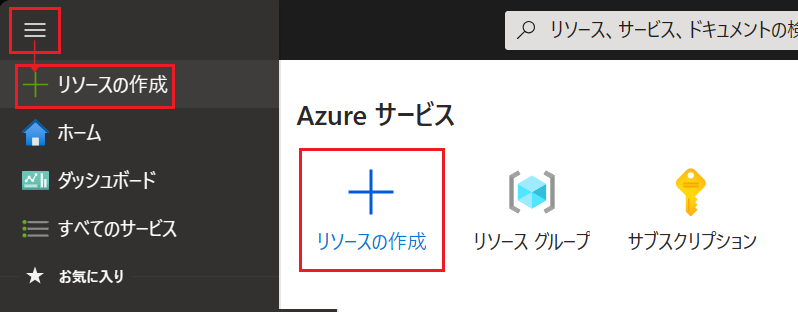
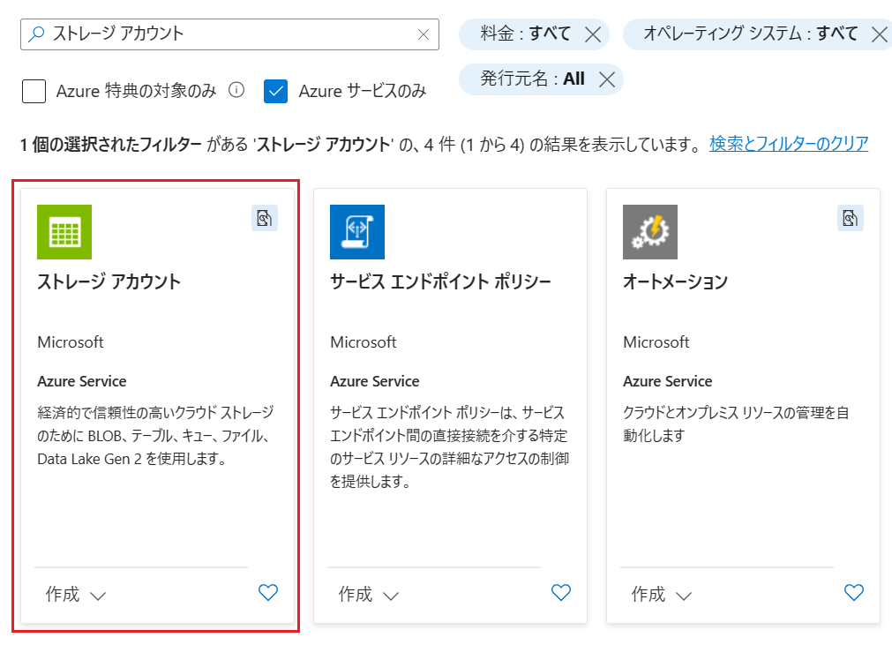
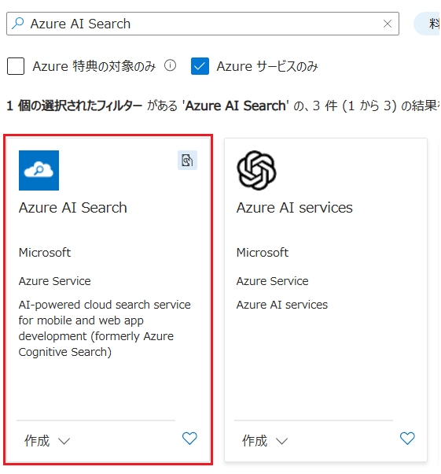

# 演習 2) Azure OpenAI Studio からの AI モデルの利用 (2/2)

## タスク 3 : 独自データの追加

Azure OpenAI Studio の UI を操作して独自のデータを追加して Azure OpenAI モデルとチャットすることができます。

これは簡易的な RAG の実装であり、検索に必要なストレージ設定や検索エンジンの設設定、データのチャンク、インデックスの作成などは自動で行われます。

このタスクでは、この機能を利用してここまでの演習でデプロイした言語モデルに独自のデータを追加(※厳密には RAG 用のアプリケーション層)し、チャットする方法を体験します。

なお、このタスクを実施する前に以下の Azure リソースを作成しておく必要があります。

Azure Storage アカウント
Azure Cognitive Search サービス
上記 2 つのリソースの作成方法は以下のとおりです。

- Azure Storage アカウント
- Azure Cognitive Search サービス

上記 2 つのリソースの作成方法は以下のとおりです。

### 準備 1 ) Azure Storage アカウントの作成

ファイルをアップロードするための Azure Storage アカウントを作成します。

具体的な手順は以下のとおりです。

\[**手順**\]

1. Azure Portal にログインします

2. ポータル画面上部の \[**+**\] リソースの作成 アイコンか、表示されていない場合は画面左上のハンバーガーメニューをクリックし、\[**リソースの作成**\] をクリックします。

    

3. 遷移した画面の検索ボックスに `ストレージ アカウント` と入力してキーボードの \[**Enter**\]キーを押下します

4. 検索結果の画面で、\[**Azure サービスのみ**\] チェックボックス にチェックを入れると **ストレージ アカウント** のタイルが表示されるのでクリックします

    

5. Azure ストレージ アカウントのプランの選択画面に遷移するので、既定のまま \[**作成**\] ボタンをクリックします

6. Azure ストレージ アカウントの \[**基本**\] 画面が表示されるので、各項目を以下のように入力します

    |  項目  |  値  |
    | ---- | ---- |
    |  **サブスクリプション \***  |  使用するサブスクリプションを選択  |
    |  **リソース グループ \***  |  既存のものを選択するか、「新規作成」リンクをクリックして作成  |
    |  **ストレージ アカウント名 \***  |  任意の名前  |
    |  **地域\*** | 任意リージョン(*) |
    |  **パフォーマンス \*** | 既定のまま |
    |  **プライマリ サービス** | 既定のまま |
    |  **冗長性 \*** | **ローカル冗長ストレージ (LRS)** |

    (*) 参照される OpenAI サービスのインスタンスと同じリージョンを選択することをお勧めします

    入力が完了したら \[**確認と作成**\] ボタンをクリックし、レビュー画面で \[**作成**\] ボタンをクリックします

ここまでの手順で Azure Storage アカウントが作成は完了です。

アップロードされるファイルを格納するためのコンテナーや Cognitive Search がアクセスするのに必要な CORS 設定などは Azure OpenAI Studio の UI が行ってくれるのでここでは行いません。

 

### 準備 2 ) Azure AI Search サービスの作成

投稿された独自のデータを検索するための Azure AI Search サービスを作成します。

具体的な手順は以下のとおりです。

\[**手順**\]

1. Azure Portal にログインします

2. ポータル画面上部の \[**+**\] リソースの作成 アイコンか、表示されていない場合は画面左上のハンバーガーメニューをクリックし、\[**リソースの作成**\] をクリックします。

    

3. 遷移した画面の検索ボックスに `Azure AI Search` と入力してキーボードの \[**Enter**\]キーを押下します

4. 検索結果の画面で、\[**Azure サービスのみ**\] チェックボックス にチェックを入れると **Azure AI Search** のタイルが表示されるのでクリックします

    

5. Azure AI Search のプランの選択画面に遷移するので、既定のまま \[**作成**\] ボタンをクリックします

6. Azure AI Search の \[**基本**\] 画面が表示されるので、各項目を以下のように入力します

    |  項目  |  値  |
    | ---- | ---- |
    |  **サブスクリプション \***  |  使用するサブスクリプションを選択  |
    |  **リソース グループ \***  |  既存のものを選択するか、「新規作成」リンクをクリックして作成  |
    |  **サービス名 \***  |  任意の名前  |
    |  **場所\*** | 任意リージョン(※1) |
    |  **価格レベル \*** | 既定のまま(※2) |

    (※1) 参照される OpenAI サービスのインスタンスと同じリージョンを選択することをお勧めします

    (※2) **Free** を選択した場合 OpenAI のサービスとの連携はできませんので、既定の **Standard** を使用してください 

    入力が完了したら \[**確認および作成**\] ボタンをクリックし、レビュー画面で \[**作成**\] ボタンをクリックします

ここまでの手順で Azure AI Search サービスが作成は完了です。

Azure Storage アカウントへの接続、インデックスの作成、データのチャンク分割などは Azure OpenAI Studio の UI が行ってくれるのでここでは行いません。

 