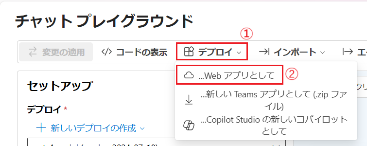
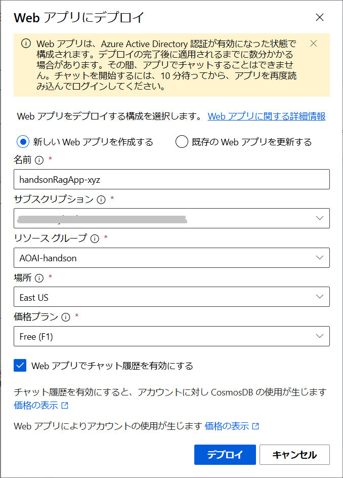
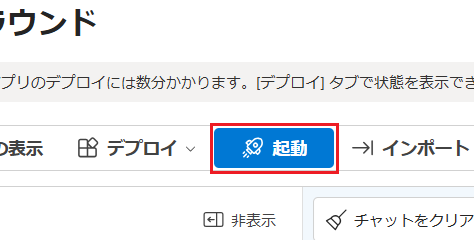

# 演習 2. オプション : Azure OpenAI Studio で作成したチャットボットを Azure App Service にデプロイ

Azure OpenAI Studio のチャット プレイグランドで動作しているチャットボットを Web アプリや Teams アプリ、Copilot Studio の新しい Copilot としてデプロイすることができます。

この手順では Web アプリとして Azure App Service にデプロイします。

具体的な手順は以下のとおりです。

\[**手順**\]

1. Azure OpanAI Studio のチャット プレイグランド画面上部のメニューから \[**デプロイ**\] - \[**...Web アプリとして**\] をクリックします

    

2. \[**Web アプリにデプロイ**\] ダイアログボックスが表示されるので、各項目を以下のように設定します

    |  項目  |  値  |
    | ---- | ---- |
    |  **名前 \***  |  任意のユニークなもの  |
    |  **サブスクリプション \***  |  任意のサブスクリプション  |
    |  **リソースグループ \***  |  任意のリソース グループ  |
    |  **場所 \***  |  任意のリージョン  |
    |  **価格プラン\***  |  F1 Free  |
    |  **Web アプリでチャット履歴を有効にする**  |  任意  |

    

     \[**デプロイ**\] ボタンをクリックすると、Azure App Service にデプロイが開始されるので完了するまで待ちます

3. デプロイが完了すると、\[**起動**\] ボタン表示されるのでクリックします

    

4. Web ブラウザーが起動し、\[**要求されているアクセス許可**\] ダイアログボックスが表示されるので \[**承諾**\] ボタンをクリックします

    Azure App Service にデプロイしたチャットボットが表示されるので任意の質問を入力し、紙飛行機のアイコン(\[**送信**\] ボタン)をクリックして回答が返ることを確認します

    

    また、[タスク 3: 独自データの追加](#%E3%82%BF%E3%82%B9%E3%82%AF-3--%E7%8B%AC%E8%87%AA%E3%83%87%E3%83%BC%E3%82%BF%E3%81%AE%E8%BF%BD%E5%8A%A0) で追加したデータも回答として返ることを確認してください。
    
    この Web アプリケーションは Azure App Service の自動認証が有効になっており、Azure Active Directory よって保護されています。そのため同じ Azure Active Directory テナントにログインしているユーザーだけが使用することができます。

ここまでの手順で、Azure OpenAI Studio で作成したチャットボットを Azure App Service にデプロイし、Web ブラウザーを介してユーザーがアクセスできるようになりました。

