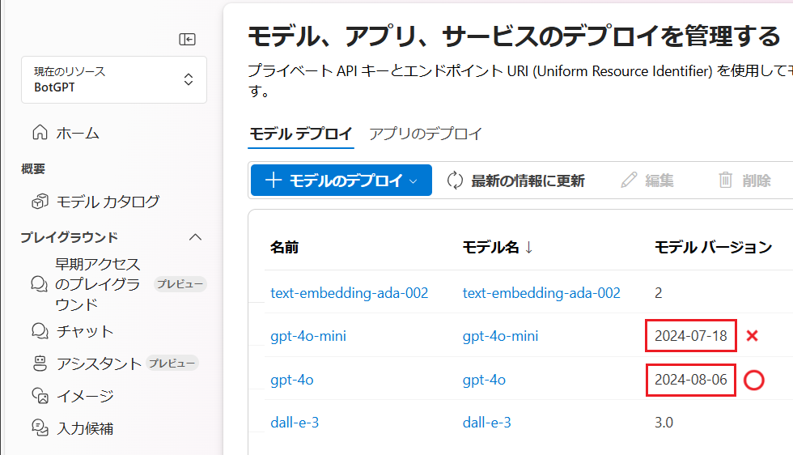

# 演習 3. 5 : 言語モデルの応答に JSON を指定する

言語モデルからのレスポンスを自然言語ではなく完全な JSON の形式で取得することにより言語モデルを "自然言語を引数とする" REST API として利用することができます(※つまり非構造化入力から構造化データを生成することができます)

たとえば、人間が操作するアプリケーションではなく、定期的に送信されてくる XML データを自動的に JSON に変換するようなアプリケーションを考えてみましょう。この場合、以下のように言語モデルに与えるプロンプトの命令と説明の自然言語の部分は定型のものでよく、\[content\] の部分のデータを入れ替えて使用します。

```text
[content]にある XML データを JSON に変換してください。正常に変換できた場合は status の値を "OK"にします。変換できなかった場合は status の値を "error" にします。

[content]
(ここに XML データを指定)
```

また、グラフィカルなデザイナー画面をユーザーに操作させ、その結果からアプリケーション内でプロンプトを生成して言語モデルに送信し、応答された JSON データを SPA のフレームワークで描画するような使い方も考えられます。

とくに演習 2.2 の[**アプリケーションからのプロンプトの利用**](Ex02-2.md#%E3%82%A2%E3%83%97%E3%83%AA%E3%82%B1%E3%83%BC%E3%82%B7%E3%83%A7%E3%83%B3%E3%81%8B%E3%82%89%E3%81%AE%E3%83%97%E3%83%AD%E3%83%B3%E3%83%97%E3%83%88%E3%81%AE%E5%88%A9%E7%94%A8) で触れたように、ユーザーからプロンプトを入力させるのではなく、アプリケーションのメニューから定型の命令を含むプロンプトを処理する場合は、応答に自然言語を含まない JSON 形式のデータを返すことが有用です。


**GPT モデルの応答に JSON を指定する設定**

OpenAI の GPT モデルには gpt-35-turbo-1106 と gpt-4-1106-preview から [**JSON mode**](https://platform.openai.com/docs/guides/structured-outputs/json-mode) という機能が提供されています。この機能は、言語モデルからの応答を構造化された形式で返すことを保証するものではありましたが、モデルの応答が特定のスキーマに準拠することを保証するものではありませんでした。

つまり、JSON で(※構造化されたデータが JSON 形式で記述されているという意味) 応答は返るものの、その構造がユーザーが指定したスキーマに準拠しているかどうかは不明であるため使いどころが難しいという問題がありました。

2024 年 8 月 に発表された [**Structured Outputs**](https://platform.openai.com/docs/guides/structured-outputs) では、JSON　mode とは異なり、モデルが常に指定されたJSONスキーマに準拠した応答を生成することを保証します。また、モデルが安全の理由によりリクエストを拒否した場合にはメッセージが返されます。

この機能は gpt-4o-mini と gpt-4o の 2024-08-06 以降のバージョンで利用可能です。

この演習では **Structured Outputs** を利用して、言語モデルからの応答を JSON 形式で取得する方法を学びます。

## 準備

* **モデルバージョンの確認**

    **Structured Outputs** を利用するためには、gpt-4o-mini または gpt-4o の 2024-08-06 以降のバージョンが必要です。以下のコードを実行して、モデルバージョンを確認します。

    

    モデルのバージョンは Azure OpenAI Studio の画左にある \[[デプロイ](https://oai.azure.com/resource/deployments)\] メニューをクリックすると表示されるデプロイ済モデルの一覧から確認することができます。

    この演習では価格の安い gpt-4o-mini を利用していますが、2024 年 8 月現在、Azure OpenAI サービスでは gpt-4o-mini は 2024-07-18 しかインストールできないので、gpt-4o-2024-08-06 をデプロイして使用してください。

    この後の演習の手順も gpt-4o-2024-08-06 の使用を前提としています。

*  **OpenAI SDK のアップデート**

    **Structured Outputs** を JavaScript/TypeScript(Node.js)、Python で使用するには最新の OpenAI SDK が必要です。
    
    この演習では Node.js を使用していますので以下のコマンドを実行して、OpenAI SDK をアップデートしてください。

    ```bash
    npm update openai
    ```

    
<!--
https://openai.com/index/introducing-structured-outputs-in-the-api/

https://platform.openai.com/docs/guides/structured-outputs

https://cookbook.openai.com/examples/structured_outputs_intro
-->

