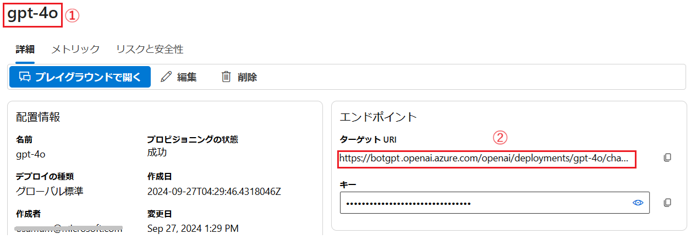
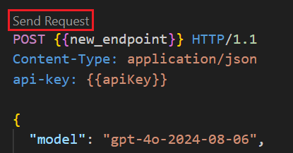
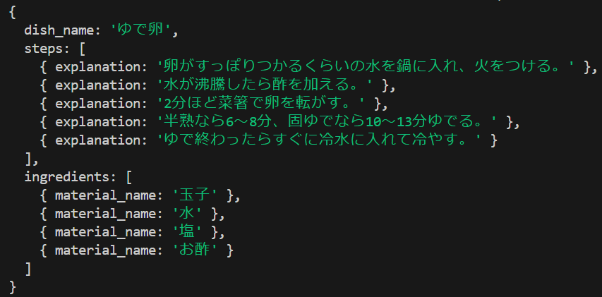

# 演習 3. 5 : 言語モデルの応答に JSON を指定する

言語モデルからのレスポンスを自然言語ではなく完全な JSON の形式で取得することにより言語モデルを "自然言語を引数とする" REST API として利用することができます(※つまり非構造化入力から構造化データを生成することができます)

たとえば、人間が操作するアプリケーションではなく、定期的に送信されてくる XML データを自動的に JSON に変換するようなアプリケーションを考えてみましょう。この場合、以下のように言語モデルに与えるプロンプトの命令と説明の自然言語の部分は定型のものでよく、\[content\] の部分のデータを入れ替えて使用します。

```text
[content]にある XML データを JSON に変換してください。
・正常に変換できた場合は status の値を "OK"にします。
・変換できなかった場合は status の値を "error" にします。

[content]
(ここに XML データを指定)
```

また、グラフィカルなデザイナー画面をユーザーに操作させ、その結果からアプリケーション内でプロンプトを生成して言語モデルに送信し、応答された JSON データを SPA のフレームワークで描画するような使い方も考えられます。

とくに演習 2.2 の[**アプリケーションからのプロンプトの利用**](Ex02-2.md#%E3%82%A2%E3%83%97%E3%83%AA%E3%82%B1%E3%83%BC%E3%82%B7%E3%83%A7%E3%83%B3%E3%81%8B%E3%82%89%E3%81%AE%E3%83%97%E3%83%AD%E3%83%B3%E3%83%97%E3%83%88%E3%81%AE%E5%88%A9%E7%94%A8) で触れたように、ユーザーからプロンプトを入力させるのではなく、アプリケーションのメニューから定型の命令を含むプロンプトを処理する場合は、応答に自然言語を含まない JSON 形式のデータを返すことが有用です。


**GPT モデルの応答に JSON を指定する設定**

OpenAI の GPT モデルには gpt-35-turbo-1106 と gpt-4-1106-preview から [**JSON mode**](https://platform.openai.com/docs/guides/structured-outputs/json-mode) という機能が提供されています。この機能は、言語モデルからの応答を構造化された形式で返すことを保証するものではありましたが、モデルの応答が特定のスキーマに準拠することを保証するものではありませんでした。

つまり、JSON で(※構造化されたデータが JSON 形式で記述されているという意味) 応答は返るものの、その構造がユーザーが指定したスキーマに準拠しているかどうかは不明であるため使いどころが難しいという問題がありました。

2024 年 8 月 に発表された [**Structured Outputs**](https://platform.openai.com/docs/guides/structured-outputs) では、JSON　mode とは異なり、モデルが常に指定されたJSONスキーマに準拠した応答を生成することを保証します。また、モデルが安全の理由によりリクエストを拒否した場合にはメッセージが返されます。

この機能は gpt-4o-mini と gpt-4o の 2024-08-06 以降のバージョンで利用可能です。

この演習では **Structured Outputs** を利用して、言語モデルからの応答を JSON 形式で取得する方法を学びます。

## 準備

* **モデルバージョンの確認**

    **Structured Outputs** を利用するためには、gpt-4o-mini または gpt-4o の 2024-08-06 以降のバージョンが必要です。以下のコードを実行して、モデルバージョンを確認します。

    

    モデルのバージョンは Azure OpenAI Studio の画左にある \[[デプロイ](https://oai.azure.com/resource/deployments)\] メニューをクリックすると表示されるデプロイ済モデルの一覧から確認することができます。

    この演習では価格の安い gpt-4o-mini を利用していますが、2024 年 8 月現在、Azure OpenAI サービスでは gpt-4o-mini は 2024-07-18 しかインストールできないので、gpt-4o-2024-08-06 をデプロイして使用してください。

    この後の演習の手順も gpt-4o-2024-08-06 の使用を前提としています。

    また、新しいモデルを使用する場合は忘れずにデプロイ名とエンドポイントをメモしておいてください。

    

*  **OpenAI SDK のアップデート**

    **Structured Outputs** を JavaScript/TypeScript(Node.js)、Python で使用するには最新の OpenAI SDK が必要です。
    
    この演習では Node.js を使用していますので以下のコマンドを実行して、OpenAI SDK をアップデートしてください。

    ```bash
    npm update openai
    ```
<br>

## タスク 1 : HTTP Client ツールによる呼び出しの確認(Structured Outputs)

Azure OpenAI サービスの言語モデルの **Structured Outputs** 機能を使用する際にやり取りされるデータ構造を確認するために Visual Studio Code の REST Client 拡張を使用してリクエストを送信し、レスポンスを確認します。

手順は以下のとおりです。

\[**手順**\]

1. [演習 3.1 タスク 2.HTTP Client ツールによる呼び出しの確認](Ex03-1.md#%E3%82%BF%E3%82%B9%E3%82%AF-2-http-client-%E3%83%84%E3%83%BC%E3%83%AB%E3%81%AB%E3%82%88%E3%82%8B%E5%91%BC%E3%81%B3%E5%87%BA%E3%81%97%E3%81%AE%E7%A2%BA%E8%AA%8D) で作成した **helloML.http** ファイルを Visual Studio Code で開きます

2. ファイルに以下の内容をコピーして貼り付けます

    ```http
    ### Structured Outputs

    @new_endpoint = ここに モデルバージョン 2024-08-06 以降のモデルのエンドポイントを記述。またapi-version は 2024-08-01-preview か、それ以降のバージョンを指定

    POST {{new_endpoint}} HTTP/1.1
    Content-Type: application/json
    api-key: {{apiKey}}

    {
        "model": "gpt-4o-2024-08-06",
        "messages": [
        {
            "role": "system",
            "content": "あなたは役に立つ数学の家庭教師です。回答にはスキーマのみを使用してください。"
        },
        {
        "role": "user",
        "content": "8x + 31 = 2 を解いてください"
        }
    ],
    "response_format": {
        "type": "json_schema",
        "json_schema": {
        "name": "math_response",
        "strict": true,
        "schema": {
            "type": "object",
            "properties": {
            "steps": {
                "type": "array",
                "items": {
                "type": "object",
                "properties": {
                    "explanation": {
                    "type": "string"
                    },
                    "output": {
                        "type": "string"
                    }
                },
                "required": ["explanation", "output"],
                "additionalProperties": false
                }
            },
                "final_answer": {
                    "type": "string"
                }
            },
                "required": ["steps", "final_answer"],
                "additionalProperties": false
                }
            }
        }
    }
    ```
    貼り付けたら `@new_endpoint` に使用するモデルのエンドポイントを記述します。また、`api-version` は `2024-08-01-preview`(※) か、それ以降のバージョンに書き換えてください。

    (※モデルのバージョンが `2024-08-06` で紛らわしいですが、API のバージョンは `2024-08-01-preview` です)

    このリクエストは言語モデルが数式 `8x + 31 = 2` を解くためのプロンプトを受け取り、その解法と最終的な答えを送信するデータの `response_format/schema`に定義した以下の JSON スキーマに従って返すように指示しています。

    ```json
    {
        {
            "steps":[
		        {
			    "explanation":""
                },
            ],
	        "final_answer" : ""
        }
    }
    ```
3. ファイルに記述されている POST の上に [**Send Request**] と表示されるのでクリックします

    


4. リクエストが送信され、レスポンスが返ったら `message/content' の中に JSON スキーマに従った回答が含まれていることを確認します

    


ここまでの手順で Azure OpenAI サービスの言語モデルで Structured Outputs を使用して任意の JSON スキーマに従ったデータを応答させることができました。

<br>


## タスク 2 : JavaScript コードからの呼び出しの確認

Azure OpenAI 言語モデルの **Structured Outputs** 機能を利用するコードを JavaScript (Node.js) で記述して実行します。

具体的な手順は以下のとおりです。

\[**手順**\]

1. [演習 3.1 タスク 2.HTTP Client ツールによる呼び出しの確認](Ex03-1.md#%E3%82%BF%E3%82%B9%E3%82%AF-2-http-client-%E3%83%84%E3%83%BC%E3%83%AB%E3%81%AB%E3%82%88%E3%82%8B%E5%91%BC%E3%81%B3%E5%87%BA%E3%81%97%E3%81%AE%E7%A2%BA%E8%AA%8D) で作成したフォルダー **devPlayground** を Visual Studio Code で開きます

2. Visual Studio Code の画面左のツリービューから **AOAI** フォルダーを右クリックし、表示されたコンテキストメニューから \[**New File**\] を選択して **structOut.js** という名前のファイルを作成します
    
    

3. 作成した **structOut.js** ファイルが編集状態で Visual Studio Code に開かれるので、以下の内容をコピーして貼りつけます。貼り付けたコードの変数 `deployment` にはこの演習の **準備** でメモしておいた言語モデルのデプロイ名を記述してください。

    このコードは必要なライブラリの参照と、この手順で設定した環境変数を読み込む処理を行い、その他、システムメッセージ等の定義を行っています。

    ```javascript
    const { AzureOpenAI } = require("openai");
    const z = require("zod");
    const {zodResponseFormat} = require("openai/helpers/zod");

    const dotenv = require("dotenv");
    dotenv.config();

    const endpoint = process.env["AZURE_OPENAI_ENDPOINT"];
    const apiKey = process.env["AZURE_OPENAI_API_KEY"];
    const apiVersion = "2024-08-01-preview";
    const deployment = "ここにモデルのデプロイ名を記述";
    ```

4. 構造化データの定義 (JSON スキーマ) を行う以下のコードを追加します

    ```javascript
    const Step = z.object({
        explanation: z.string()
    })

    const Ingredients =z.object({
        material_name: z.string()
    })

    const RecepiResponse = z.object({
        dish_name: z.string(),
        steps: z.array(Step),
        ingredients: z.array(Ingredients)
    })
    ```
    構造化データの定義は、TypeScript向けのスキーマ宣言とデータ検証のためのライブラリである [**Zod**](https://www.npmjs.com/package/zod) を使用します。

    OpenAI の Node.js 用の SDK には zod オブジェクトの JSON スキーマへのデータ型の変換、JSON 応答の型指定データ構造への逆シリアル化、拒否が発生した場合の解析などを行うヘルパー関数が含まれています。なお、Python で記述する場合は [**Pydantic**](https://pydantic-docs.helpmanual.io/) が使用されます。

    追加したコードで定義しているのは以下のような JSON スキーマです。

    ```json
    {
        "dish_name": "",
        "steps": [
            {
                "explanation": ""
            }
        ],
        "ingredients": [
            {
                "material_name": ""
            }
        ]
    }
    ```
5. システムメッセージと、非構造化データであるプロントを送信し、生成された構造化データを取得する関数を記述します

    以下のコードを追加します

    ```javascript
    var messages = [
        { role: 'system', content: 'あなたは料理教室のアシスタントです。講師から与えられたレシピをJSONにして答えます' }
    ];

    //Azure OpenAI にメッセージを送信する関数
    async function sendMessage(message) {
        if (message) messages.push({ role: 'user', content: message });
        const client = new AzureOpenAI({ endpoint, apiKey, apiVersion, deployment });
        const result = await client.beta.chat.completions.parse({
            messages: messages,
            response_format: zodResponseFormat(RecepiResponse, 'RecepiResponse'),
        });

        const resposeMsg = result.choices[0]?.message;
        if (resposeMsg?.parsed) {
            //構造化データをコンソールに出力
            console.log(resposeMsg.parsed);
            //文字列化する場合は以下のように記述
            //console.log(JSON.stringify(resposeMsg.parsed));
        } else {
            console.log(resposeMsg.refusal);
        }
    }
    ```
6. 最後に言語モデルに送信するプロンプトと、メッセージを送信する関数を呼び出すコードを追加します

    ```javascript
    const message = 'ゆで卵の作り方について説明します。\n' 
        + '材料は、玉子、水、塩、お酢です。\nまず、卵がすっぽりつかるくらいの水を鍋に入れ火をつけ、沸騰したら酢を入れます。\n' 
        + '2分ほど菜箸で卵を転がした後、好みの固さになる時間までゆでます。半熟なら6～8分、固ゆでなら10～13分が目安です。\n' 
        + 'ゆで終わったら、すぐに冷水に入れて冷やし、殻がむきやすい状態にします。';

    sendMessage(`content:${message}`);
    ```

    キーボードの `Ctrl + S` を押してファイルを保存します。

7. 記述したコードが正しく動作するか確認します。

    Visual Studio Code のターミナルで以下のコマンドを実行してコードを実行します

    ```bash
    node AOAI/structOut.js
    ```
    コードが正しく動作していれば、コンソールに構造化データが表示されます。

    

もしうまくいかない場合は以下のサンプルのコードを使用してください。

* [**Structured Outputs のサンプルコード**](samples/structOut.js)

今回は非構造化データとしてゆで卵のレシピを言語モデルに与え、言語モデルに指定したスキーマの構造化データを生成させました。

この方法は、たとえばレビューサイトにある自社製品のレビューの内容を言語モデルに与えて構造化データ化し、自社のデータベースに蓄積して分析する、といったことに応用できます。

なお、**Structured Outputs** はユーザーとの対話ではなく、アプリケーションとのデータ交換用の機能であるため、ここまでの演習で作成したチャットボット アプリケーションへの機能の統合は行いません。

<br>

## まとめ

この演習では Azure OpenAI サービスの言語モデルの **Structured Outputs** 機能を使用して、言語モデルからの応答を JSON 形式で取得する方法を学びました。

**Structured Outputs** についてのより詳しい内容については、以下のリンクを参照してください。

* [Introducing Structured Outputs in the API](https://openai.com/index/introducing-structured-outputs-in-the-api/)
* [Introduction to Structured Outputs](https://cookbook.openai.com/examples/structured_outputs_intro)
* [Structured Outputs - OpenAI API](https://platform.openai.com/docs/guides/structured-outputs/introduction)

この演習では JavaScript でコードを記述しましたが Python での記述方法は以下のリンクを参照してください。

* [How to use structured outputs with Azure OpenAI Service - Azure OpenAI](https://learn.microsoft.com/ja-jp/azure/ai-services/openai/how-to/structured-outputs?tabs=python)

<br>

## 次へ

👉 [**演習 4 : 演習用ボット アプリケーションのフレームワークへの移植**](Ex04-0.md)

<br>

<hr>

👈 [**演習 3. 4 : RAG (Retrieval-Augmented Generation) の実装** ](Ex03-4.md)

🏚️ [README に戻る](README.md)

    


