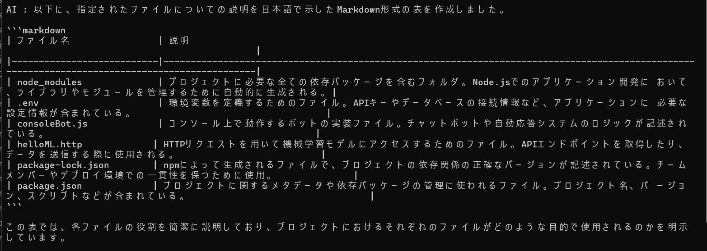
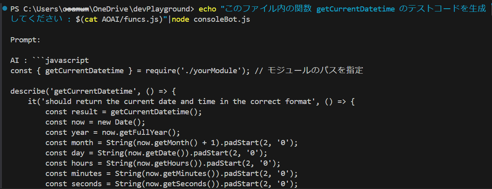

# 演習 3. 7 : 演習用ボットをコンソール アシスタントとして利用する

ここまでの演習で作成したコンソールボットアプリケーションは、コンソールで動作するため、Windows PowerShell や Bash 等のコマンドの結果を | (パイプ) を使用して受け取ることができます。

この仕組みを使用して、コンソールボットアプリケーションをコンソール アシスタントとして利用することができます。

動作を確認可能な使用例をいくつか紹介しますのでお試しください。

具体的な手順は以下の通りです。

1. Visual Studio Code のコンソール画面、もしくは OS のターミナル画面で、作業ディレクトリを [演習 3.2-2](Ex03-1.md#%E3%82%BF%E3%82%B9%E3%82%AF-2-http-client-%E3%83%84%E3%83%BC%E3%83%AB%E3%81%AB%E3%82%88%E3%82%8B%E5%91%BC%E3%81%B3%E5%87%BA%E3%81%97%E3%81%AE%E7%A2%BA%E8%AA%8D) で作成した **devPlayground** ディレクトリに移動します。

2. **devPlayground** ディレクトリはコンソールボット アプリケーションのプロジェクトディレクトリになっているので、ボットにファイルの一覧の表示と、各ファイルとディレクトリの説明を依頼します。

    Visual Studio Code のコンソール画面で実行する場合は、以下のコマンドを、

    ```bash
    echo "以下の内容をマークダウンの表で出力し、かつ各ファイルの説明を追加してください: $(ls)"|node consoleBot.js
    ```

    OS のターミナル画面で実行する場合は、日本語がコンソールボット アプリケーションに渡った際に文字化けが発生する可能性があるため、以下のコマンドを入力し、キーボードの \[**Enter**\] キーを押下します。

    ```bash
    echo "Please output the following content in a Markdown table format. And explain each files with Japanese.: $(ls)"|node consoleBot.js
    ```

    以下のような出力が返ることを確認します。

    

3. devPlayground/AOAI ディレクトリにある **funcs.js** に記述されている全ての関数の説明をコンソールボットに依頼します

    Visual Studio Code のコンソール画面で実行する場合は、以下のコマンドを、

    ```bash
    echo "このファイル内の関数名を列挙し、各関数の説明をしてください : $(cat AOAI/funcs.js)"|node consoleBot.js
    ```

    OS のターミナル画面で実行する場合は、日本語がコンソールボット アプリケーションに渡った際に文字化けが発生する可能性があるため、以下のコマンドを入力し、キーボードの \[**Enter**\] キーを押下します。

    ```bash
    echo "Please list the names of the functions in this file. And explain each files with Japanese. : $(cat AOAI/funcs.js)"|node consoleBot.js
    ```

    以下のような出力が返ることを確認します。

    

4. ファイル **funcs.js** 内の関数 **getCurrentDatetime** のテストコードの生成をコンソールボットに依頼します

     Visual Studio Code のコンソール画面で実行する場合は、以下のコマンドを、

    ```bash
    echo "このファイル内の関数 getCurrentDatetime のテストコードを生成してください : $(cat AOAI/funcs.js)"|node consoleBot.js
    ```

    OS のターミナル画面で実行する場合は、日本語がコンソールボット アプリケーションに渡った際に文字化けが発生する可能性があるため、以下のコマンドを入力し、キーボードの \[**Enter**\] キーを押下します。

    ```bash
    echo "Please generate test code for the function getCurrentDatetime in this file.: $(cat AOAI/funcs.js)"|node consoleBot.js
    ```

    以下のような出力が返ることを確認します。

    

    ここまでの演習で、コンソールボットアプリケーションは | (パイプ) を使用することでターミナル画面で実行可能なさまざまなコマンドの実行結果を受け取り、それに対して適切な応答を返すことができることが確認できました。

このように、コンソールボットアプリケーションをコンソール アシスタントとして利用することで、コンソール画面での作業を効率化することができます。

>[!CAUTION]
>この演習では言語モデルにテストコードを生成させましたが、実際の開発作業においては、生成されたコードをそのまま使用することはせず、必ず生成されたコードの内容に問題がないか確認のうえ、ご自身の責任のもとで使用してください。

<br>

## まとめ

言語モデルの利用は、GUI を介したユーザーとの対話だけでなく、コンソール アプリケーションと統合することで、コンソール画面での作業を効率化することができます。

echo コマンドと | (パイプ) を使用することで、実行中のシェルで用意されているさまざまなコマンドの実行結果を利用してプロンプトを生成してコマンド ボットアプリケーションに渡すことができます。

アイディア次第でさまざまな機能が実装可能ですので、ぜひ自分のアイディアを実装してみてください。

PowerShell と Bash でのパイプの使い型については、以下のリンクを参照してください。

* [**ワンライナーとパイプライン**](https://learn.microsoft.com/ja-jp/powershell/scripting/learn/ps101/04-pipelines?view=powershell-7.4)

* [**3.2.3 Pipelines - Bash Reference Manual**](https://www.gnu.org/software/bash/manual/bash.html#Pipelines)

<br>

## 次へ

👉 [**演習 4 : 演習用ボット アプリケーションのフレームワークへの移植**](Ex04-0.md)

<br>

<hr>

👈 [**演習 3. 6 : 言語モデルの応答に JSON を指定する** ](Ex03-6.md)

🏚️ [README に戻る](README.md)
