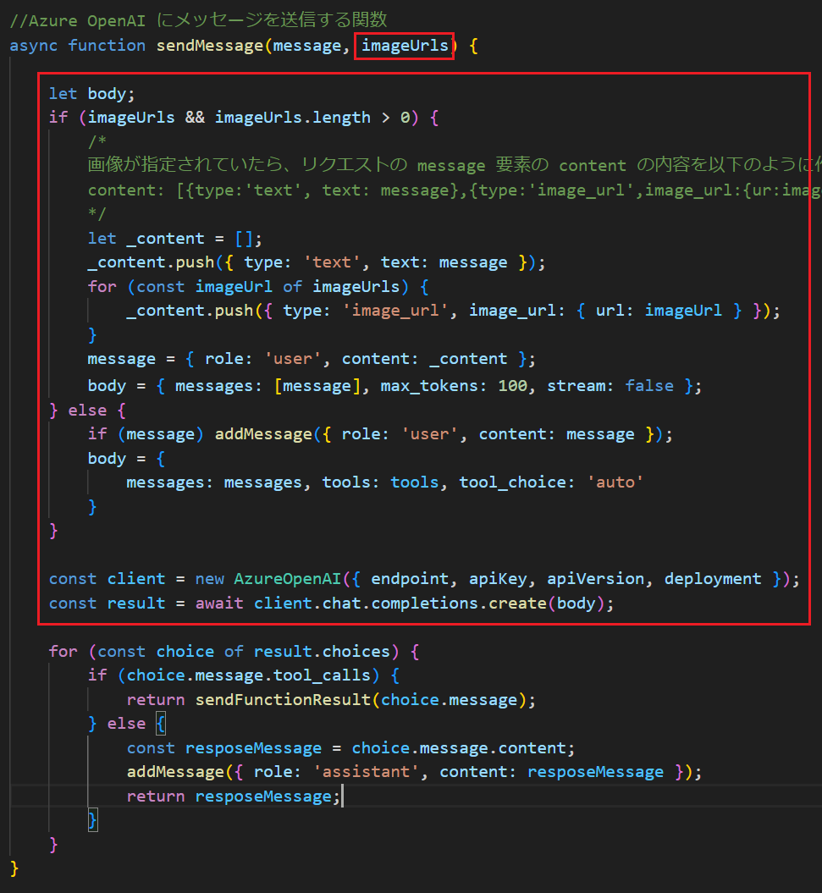

# 演習 3.オプション : GTP モデルを使用した画像認識

Azure OpenAI サービスが提供する [GPT-4o、GPT-4o mini、GPT-4 Turbo](https://learn.microsoft.com/ja-jp/azure/ai-services/openai/concepts/models?tabs=python-secure#gpt-4o-and-gpt-4-turbo) モデルはテキストと画像の両方を入力として受け入れることができるマルチモーダル バージョンを備えています。

具体的には、一回のリクエストにつき、20 MB 以下の画像を最大 10 枚まで認識し、その画像に関連するテキストを生成することができます。

この機能を使用して、画像を入力として受け取り、その画像に関連するテキストを生成するモデルを構築します。

この演習の内容は、ここまでの演習で準備したリソースを実施可能ですのでとくに追加の準備は必要ありません。

<br>

## タスク 1 :  HTTP Client ツールによる呼び出しの確認(画像認識)

Azure OpenAI サービスの言語モデルで画像認識を行う際にやり取りされるデータ構造を確認するために Visual Studio Code の REST Client 拡張を使用してリクエストを送信し、レスポンスを確認します。

手順は以下のとおりです。

[**手順**]

1. [演習 3.1-2 : **HTTP Client ツールによる呼び出しの確認**](Ex03-1.md#%E3%82%BF%E3%82%B9%E3%82%AF-2-http-client-%E3%83%84%E3%83%BC%E3%83%AB%E3%81%AB%E3%82%88%E3%82%8B%E5%91%BC%E3%81%B3%E5%87%BA%E3%81%97%E3%81%AE%E7%A2%BA%E8%AA%8D) で作成した **helloML.http** ファイルを開きます

2. ファイルに以下の内容をコピーして貼り付けます

    ```http
    ### GTP-4 モデルによる画像認識

    POST {{endpoint}} HTTP/1.1
    Content-Type: application/json
    api-key: {{apiKey}}

    {
        "messages": [
            {
                "role":"user",
                "content":[
                    {
	                    "type": "text",
	                    "text": "この画像を説明してください:"
	                },
	                {
	                    "type": "image_url",
	                    "image_url": {
                        "url": "https://osamum.github.io/publish/assets/steak.jpg"
                        }
                    } 
            ] 
            }
        ],
        "max_tokens": 100, 
        "stream": false 
    }
    ```

    認識させる画像は以下です。

    

3. ファイルに記述されている **POST** の上に \[**Send Request**\] と表示されるのでクリックします

    

    なお、レスポンスが返るまでに数秒かかる場合があります。

4. レスポンスが返ったら choices/message/content の中身を確認します

    

    画像の内容を説明するメッセージが生成されていることを確認します。

ここまでの手順で Azure OpenAI サービスの言語モデルで画像を認識させる際の基本的なデータ構造とそのやり取りを確認しました。

GPT-4 モデルの画像認識機能は、複数枚数の画像の指定や以下のような Base 64 エンコードされた画像データの入力もサポートしています。

```
"type": "image_url",
"image_url": {
   "url": "data:image/jpeg;base64,<your_image_data>"
}
```

この機能を利用すると、ローカルファイルの画像もリクエストに含めることができます。

詳細については以下のドキュメントをご参照ください。

* [クイックスタート: AI チャットで画像を使用する](https://learn.microsoft.com/ja-jp/azure/ai-services/openai/gpt-v-quickstart?tabs=image%2Ccommand-line%2Ctypescript&pivots=rest-api)

* [GPT-4 Turbo with Vision を使用する](https://learn.microsoft.com/ja-jp/azure/ai-services/openai/how-to/gpt-with-vision)

<br>

## タスク 2 :  チャットボット アプリへの画像認識機能の統合

画像認識機能をチャットボット アプリケーションに統合します。

作業内容としては以下の 2 点です。

* consoleBot.js での作業
    
    - ユーザーのメッセージに含まれる画像ファイルへの URL を配列として取り出す

* AOAI/lm.js での作業

    - 言語モデルにメッセージを送信する sendMessage 関数に画像の URL 配列を受け取るための引数を追加
    - URL 配列の引数が空でなければ、画像認識用のスキーマを生成

### タスク 2-1 : AOAI/lm.js の sendMessage 関数の変更

作業効率化の都合上、AOAI/lm.js 側の作業から行います。

具体的な手順は以下の通りです。

\[**手順**\]

1. [演習 3.1-2](Ex03-1.md#%E3%82%BF%E3%82%B9%E3%82%AF-2-http-client-%E3%83%84%E3%83%BC%E3%83%AB%E3%81%AB%E3%82%88%E3%82%8B%E5%91%BC%E3%81%B3%E5%87%BA%E3%81%97%E3%81%AE%E7%A2%BA%E8%AA%8D)  で作成したフォルダー **devPlayground** を Visual Studio Code で開きます

2. **AOAI/lm.js** を開き、**sendMessage** 関数の引数に以下のように **imageUrls** を追加します

    ```javascript
    async function sendMessage(conversationId, message, imageUrls) {
    ```

3. 同関数の関数名の下の行から、以下のコードの手前(1 行うえ) まで行のコードを、

    ```javascript
    for (const choice of result.choices) {
    ```

    以下のコードに置き換えます

    ```javascript
    let body;
    if (imageUrls && imageUrls.length > 0) {
        /*
        画像が指定されていたら、リクエストの message 要素の content の内容を以下のように作成
        content: [{type:'text', text: message},{type:'image_url',image_url:{ur:imageUrl}},{複数画像の場合}] };
        */
        let _content = [];
        _content.push({ type: 'text', text: message });
        for (const imageUrl of imageUrls) {
            _content.push({ type: 'image_url', image_url: { url: imageUrl } });
        }
        message = { role: 'user', content: _content };

        body = { messages: [message], max_tokens: 100, stream: false };
    } else {
        if (message) addMessage({ role: 'user', content: message });
        body = {
            messages: messages, tools: tools, tool_choice: 'auto'
        }
    }

    const client = new AzureOpenAI({ endpoint, apiKey, apiVersion, deployment });
    const result = await client.chat.completions.create(body);
    ```
  
    この作業作業で変更された **sendMessage** 関数内のコードは以下の赤枠の部分です。

    

    変更が完了したキーボードの \[**crtl**\] + \[**S**\] キーを押下して保存します。

ここのまでの手順で、画像認識機能を利用するためのスキーマを生成する処理を AOAI/lm.js に追加しました。

>[!NOTE]
>GTP-4 モデルが一回の会話で処理できる画像の最大数は 10 枚ですが、このコードでは演習用としてコードをシンプルにする目的て枚数のチェックやエラー処理は省略しています。実際のアプリケーション開発の際にはこれらの処理を適切に追加してください。

<br>

### タスク 2-2 : consoleBot.js の変更

