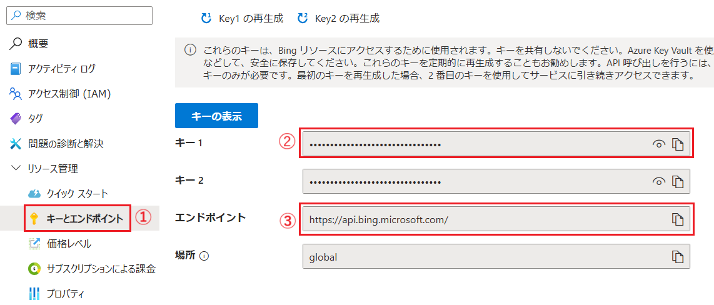
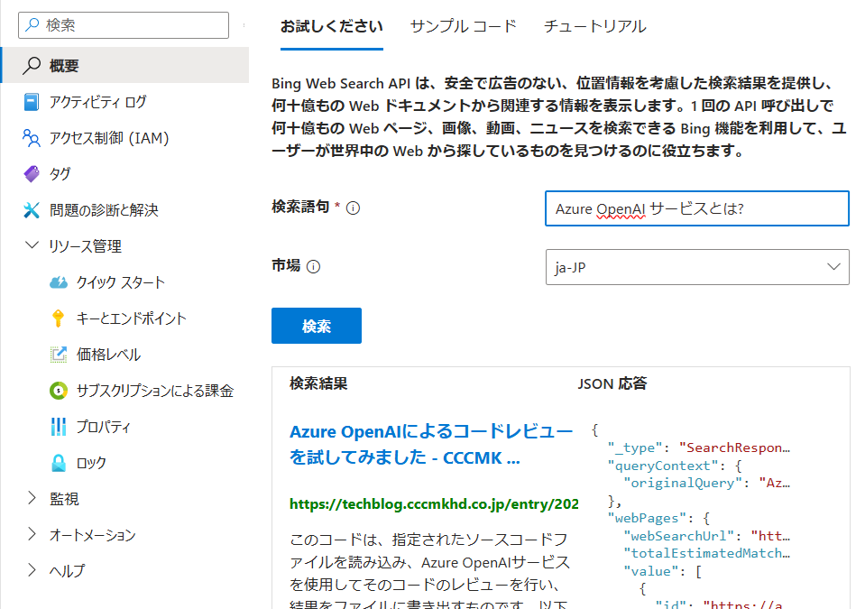

# 演習 3.オプション : Web の情報を検索する

演習で作成しているボット アプリケーションの知識の拡張として、Web の情報を検索する機能を追加します。

この演習では、ボットがユーザーの質問に答えるために Web 検索を使用する方法を学びます。

アプリケーションの処理の流れとしては、RAG のデータソースに情報がなく、関数呼び出し(Function Call) にも該当せず、言語モデルの知識にも情報が無かった場合はに Web 検索を行い、検索結果上位 3 件の Web ページのコンテンツを取得してその内容から回答を生成して返す仕様とします。

以下のフローチャート図の ① から ③ の処理を実装します。

```mermaid
graph TD
    A -- [ユーザー] --> B{RAG に情報がある}
    B -- はい --> C[RAG の検索結果をもとに言語モデルが回答を生成]
    C --> M[応答]
    B -- いいえ --> E{関数呼び出しの条件に合致}
    E -- はい --> F[関数呼び出しを行う]
    F --> G[関数の実行結果をもとに言語モデルが回答を生成]
    G --> M[応答]
    E -- いいえ --> I{① 言語モデルの知識に情報がある}
    I -- はい --> M[応答]
    I -- いいえ --> K[➁ Web 検索を行う]
    K --> L[③ 検索結果上位 3 つの Web サイトからコンテンツを取得し言語モデルが回答を生成]
    L --> M[応答]
```

## 準備 - Bing Web Search のデプロイ

この演習では Web の検索に [Bing Web Search API](https://learn.microsoft.com/ja-jp/bing/search-apis/bing-web-search/bing-api-comparison) を使用します。

Azure Portal での Bing Web Search API のデプロイ手順は以下の通りです。

\[**手順**\]

1. Azure ポータルにサインインします

    [https://portal.azure.com](https://portal.azure.com/#home)

2. ポータル画面上部の \[**+**\] リソースの作成 アイコンか、表示されていない場合は画面左上のハンバーガーメニューをクリックし、\[**リソースの作成**\] をクリックします。

    

3. 遷移した画面の検索ボックスに **bing search** と入力してキーボードの \[**Enter**\] キーを押下します

    検索結果の画面で、\[**Azure サービスのみ**\] チェックボックス にチェックを入れると **Bing Search v7** のタイルが表示されるのでクリックします

    

4. Bing Search v7 のプランの選択画面に遷移するので、既定のまま \[**作成**\] ボタンをクリックします

5. Azure OpenAI の作成の \[**基本**\] 画面が表示されるので、各項目を以下のように入力します

    |  項目  |  値  |
    | ---- | ---- |
    |  **サブスクリプション \***  |  使用するサブスクリプションを選択  |
    |  **リソース グループ \***  |  既存のものを選択するか、「新規作成」リンクをクリックして作成  |
    |  **名前 \*** | 任意の名前 |
    |  **リージョン** | `グローバル` |
    |  **価格レベル \*** | **F1** |
    |  \[**ご契約条件**\] のチェックボックス | チェック |

    

    入力が完了したら、\[**確認と作成**\] ボタンをクリックし、その後 \[**作成**\] ボタンをクリックします。

    Bing Search の作成が完了すると、\[デプロイが完了しました\] というメッセージが表示されます。この画面で \[**リソースに移動**\] ボタンをクリックします

6. 作成した Bing Search のリソース画面が表示されるので、画面左のメニューバーから \[リソース管理\] を展開し、\[**キーとエンドポイント**\] をクリックします

7. キーとエンドポイントの画面で、\[**キー 1**\] と \[**エンドポイント**\] の値をコピーし、メモ帳などに保持しておきます

    

ここまでの手順で Bing Web Search のデプロイが完了しました。

Bing Search の検索は \[概要\] 画面の \[**お試しください**\] タブで動作確認が可能です。



<br>

# タスク 1 :  HTTP Client ツールによる呼び出しの確認(Bing Web Search)

Azure OpenAI サービスの言語モデルの関数呼び出しを行う際にやり取りされるデータ構造を確認するために Visual Studio Code の REST Client 拡張を使用してリクエストを送信し、レスポンスを確認します。

手順は以下のとおりです。

[**手順**]

1. [演習 3.1-2 : **HTTP Client ツールによる呼び出しの確認**](Ex03-1.md#%E3%82%BF%E3%82%B9%E3%82%AF-2-http-client-%E3%83%84%E3%83%BC%E3%83%AB%E3%81%AB%E3%82%88%E3%82%8B%E5%91%BC%E3%81%B3%E5%87%BA%E3%81%97%E3%81%AE%E7%A2%BA%E8%AA%8D) で作成した **helloML.http** ファイルを開きます

2. ファイルに以下の内容をコピーして貼り付け、**BingSearch-subscriptionKey** には Azure ポータルで取得した Bing Web Search のキーを入力します

    ```http
    ### Function Calling の実行

    @BingSearch-endpoint=https://api.bing.microsoft.com/v7.0/search
    @BingSearch-subscriptionKey=ここにBing Web Search のキーを入力
    @search_keyword=Azure OpenAI サービスについて教えてください

    GET {{BingSearch-endpoint}}?q={{search_keyword}}&count=5&offset=0&mkt=ja-JP&safeSearch=Strict HTTP/1.1
    Ocp-Apim-Subscription-Key: {{BingSearch-subscriptionKey}}
    ```

3. ファイルに記述されている **GET** の上に \[**Send Request**\] と表示されるのでクリックします

     

4. リクエストが送信され、レスポンスが返ったらクエリーパラメーター **count** に指定してある 5 件の検索結果が表示されることを確認します

    

ここまでの手順で HTTP での Bing Web Search API の呼び出しとレスポンスの内容が確認できました。

なお、Bing Web Search API を呼び出す際に使用できるクエリーパラメーターについては以下のドキュメントを

* [**Web Search API v7 query parameters**](https://learn.microsoft.com/ja-jp/bing/search-apis/bing-web-search/reference/query-parameters)

応答で返される JSON データの詳細については以下のドキュメントを参照してください。

* [**Web Search API v7 response objects**](https://learn.microsoft.com/ja-jp/bing/search-apis/bing-web-search/reference/response-objects)


<br>

## タスク 2 : Web 検索とコンテンツ取得を行う機能の実装

Bing Web Search API を使用して Web 検索を行い、その結果から言語モデルが回答を生成するのに必要な情報を提供する機能を実装します。

この機能は Bing Web Search API が提供する機能だけでは実装できません。

なぜならば、Bing Web Search API は検索結果の **snippet** プロパティには Web ページのコンテンツを説明するテキストが含まれますが、その情報だけで言語モデルが回答を生成するのに十分な情報が得られるとは限らないためです。

そのため  Bing Web Search API の検索結果に含まれる URL が示す Web ページのコンテンツを取得する必要があります。

ただし、Web ページには回答の生成には必要のない HTML タグやスクリプトが含まれているためそのまま言語モデルに渡したのでは無駄に Token を消費することになります。

よって、この機能の実装には Web の検索機能以外に以下の機能が必要となります。

1. Web ページのコンテンツを取得する機能
2. Web ページのコンテンツから不要な HTML タグやスクリプト、スタイルシートを除去する機能

このタスクではこれらの機能を実装します。

<br>

### タスク 2-1 : Web ページのコンテンツを取得する機能の実装

URL から Web ページのコンテンツを取得する機能を実装します。

この作業の具体的な手順は以下のておりです。

\[**手順**\]

1. [演習 3.1-2](Ex03-1.md#%E3%82%BF%E3%82%B9%E3%82%AF-2-http-client-%E3%83%84%E3%83%BC%E3%83%AB%E3%81%AB%E3%82%88%E3%82%8B%E5%91%BC%E3%81%B3%E5%87%BA%E3%81%97%E3%81%AE%E7%A2%BA%E8%AA%8D)  で作成したフォルダー **devPlayground** を Visual Studio Code で開きます

2. はじめにボットアプリケーションから呼び出される関数を定義するためのファイルを作成します

    Visual Studio Code の画面左のツリービューから **AOAI** フォルダーを右クリックし、表示されたコンテキストメニューから \[**New File**\] を選択して **webSearch.js** という名前のファイルを作成します
    
    

3. 記述する関数は言語モデルを使用して作成します

    Visual Studio Code の上部のメニュー \[**View**] - [**Terminal**] をクリックし、画面下部にターミナル画面が表示されるので、以下のコマンドを実行してチャットボット アプリケーションを起動します。

    ```bash
    node consoleBot.js
    ```

    ターミナル画面に `Prompt:` が表示されたら、以下のメッセージを入力して[**Enter**\] キーを押下します

    ```
    引数 url に指定された Web ページの body タグの内容だけを取得して返り値として返す getBodyContent と名前の関数を JavaScript で生成してください。なお HTTP リクエストには fetch を使用し、リクエストの際の user-agent には Microsoft Edge のものを使用してください。body タグの検出は正規表現か文字列操作関数でおこなってください
    ```

    キーボードの \[**Ctrl**\] + \[**C**\] キーを押下してチャットボットアプリを終了します。
    
    言語モデルが生成した **getBodyContent** 関数のコードをコピーして、作成した **webSearch.js** ファイルに貼り付け、キーボードの \[**Ctrl**\] + \[**S**\] キーを押下して保存します。

4. 貼り付けたコードが正しく動作するか確認します。

    以下のコードを **webSearch.js** ファイルに追加します

    ```javascript
    getBodyContent('https://osamum.github.io/publish/').then(body => {
        console.log(body);
    });
    ```

    Visual Studio Code のターミナル画面で以下のコマンドを実行して関数が正しく動作するか確認します

    ```bash
    node AOAI/webSearch.js
    ```

    コンソールに以下の内容が表示されれば正しく動作しています。

    ```
    <style>
        div{
            color:black;
        }
    </style>
    <h1>online assets</h1>

    <div>
        このページは <a href="https://aka.ms/firststep-aoai-appdev">Azure OpenAI アプリケーション開発ハンズオン</a> の検証用ページです。
        </a> 
    </div>

    
    
    
    <script>
        console.log("Hello, world!");
    </script>
    ```

ここまでの手順で Web ページのコンテンツを取得する機能の実装が完了しました。

もしうまく動作しない場合は、以下のコードをお試しください。

```javascript
async function getBodyContent(url) {
    const response = await fetch(url, {
        method: 'GET',
        headers: {
            'User-Agent': 'Mozilla/5.0 (Windows NT 10.0; Win64; x64) AppleWebKit/537.36 (KHTML, like Gecko) Chrome/91.0.4472.124 Safari/537.36'
        }
    });
    const text = await response.text();
    const bodyMatch = text.match(/<body[^>]*>([\s\S]*?)<\/body>/i);
    return bodyMatch ? bodyMatch[1] : null;
}
```
<br>

### タスク 2-2 : Web ページのコンテンツから不要な HTML タグやスクリプト、スタイルシートを除去する機能の実装

前述の **getBodyContent** 関数で取得した Web ページのコンテンツから不要な HTML タグやスクリプト、スタイルシートを除去する機能を実装します。

この処理には \<script\>～</script\> や \<style\>～\</style\>** などのように HTML タグで囲まれた文字列とタグそのものを除去する処理と、\< と \> で囲まれた文字列を除去する 2 つの処理が必要です。

この手順ではこれらの処理を行う関数を実装します。

具体的な手順は以下のとおりです。