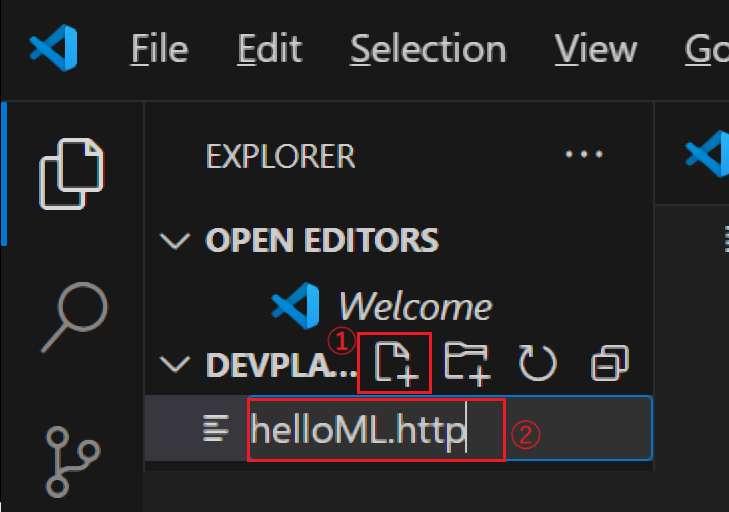
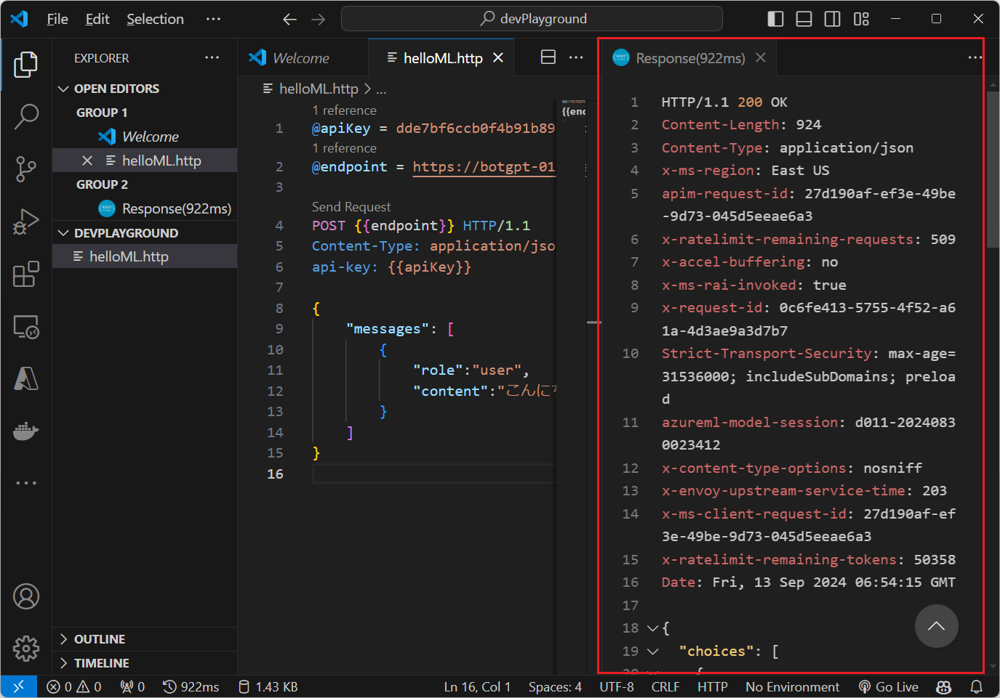
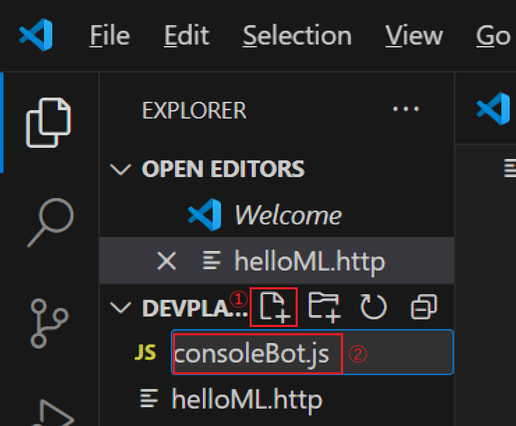
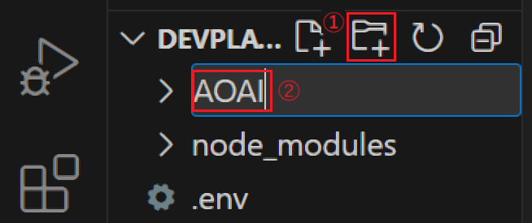

# Azure Open AI サービスとアプリケーションの統合

この演習では Azure OpenAI サービスか提供するサービスを外部から利用する方法を体験します。

Azure OpenAI の言語モデルは REST API を提供しているため HTTPS を扱える開発言語であればその機能を利用することができます。

## 目次

この演習 3 で実施するタスクは以下のとおりです

- [タスク 1 : Azure Open AI サービスの API 利用]()
    - [curl コマンドによる呼び出しの確認]()
    - [HTTP Client ツールによる呼び出しの確認]()
    - [会話構造について]()

- [タスク 2 : ボット アプリケーションの作成]()
    - [コンソールで動作するオウム返しアプリケーションの作成]()
    - [Azure OpenAI ライブラリを利用した言語モデルへのメッセージの送信]()
	- [コンソールで動作する基本的なチャットボット アプリの作成]()

- [タスク 3 : Function Calling 機能を使用した任意の関数の実行]()
    - [REST による動作の確認]()
	- [チャットボット アプリからの内部関数の呼び出し]()
	- [チャットボット アプリからの画像生成モデルの利用]()

- [タスク 4 : RAG (Retrieval-Augmented Generation) の実装]()
    - [キーワードのベクトル化]()
    - [ベクトル検索機能の作成]()
	- [RAG の実装]()

## 準備

演習 3 のタスクを実施するためには以下の準備が必要です。

もし以下アプリケーションやランタイムのインストールが済んでいない場合はリンク先の手順に従ってインストールを行ってください。

### ツールのインストール

- [**Visual Studio Code**](https://code.visualstudio.com/)

    - [**REST Client 拡張**](https://marketplace.visualstudio.com/items?itemName=humao.rest-client)


- [**Node.js**](https://nodejs.org/ja/)

    > 最新の LTS 版をインストールしてください。もしローカル環境で Node.js のバージョンを切り替える必要がある場合には Windows では [**nvm-windows**](https://github.com/coreybutler/nvm-windows) 、Mac では [nvm](https://github.com/nvm-sh/nvm) を使用すると便利です。
    > 詳しくは以下のドキュメントを参照してください。

    - [**nvm-windows のインストール**](https://learn.microsoft.com/ja-jp/windows/dev-environment/javascript/nodejs-on-windows#install-nvm-windows-nodejs-and-npm)

    - [**nvm のインストール**](https://learn.microsoft.com/ja-jp/windows/dev-environment/javascript/nodejs-on-wsl#install-nvm-nodejs-and-npm)

### 接続情報の入手

REST API の呼び出しに必要となるエンドポイントと API キーを入手します。

具体的な手順は以下のとおりです。

1. Azure Portal にサインインします

2. [**演習 1 - タスク 1 : Azure ポータルから Open AI リソースを作成**](Ex01.md#%E3%82%BF%E3%82%B9%E3%82%AF-1--azure-%E3%83%9D%E3%83%BC%E3%82%BF%E3%83%AB%E3%81%8B%E3%82%89-open-ai-%E3%83%AA%E3%82%BD%E3%83%BC%E3%82%B9%E3%82%92%E4%BD%9C%E6%88%90) で作成した OpenAI サービス インスタンスのプロパティ画面を開きます

3. 画面左側のメニューから **キーとエンドポイント** を選択し、表示された画面で \[**キー**\](※キー 1、キー 2 のどちらでも構いません)と \[**エンドポイント**\] をコピーします

    

コピーしたキーとエンドポイントは後続のタスクで使用しますので、メモ帳などに貼り付けて保持してください。

このキーとエンドポイントは言語モデルだけでなく、同じく Azure OpenAI インスタンスにデプロイされた埋め込みモデル、画像生成モデルとも共通です。なおこの 2 のモデルはそれぞれタスク 2、タスク 3 で使用されます。

<br>

## タスク 1 : Azure Open AI サービスの API 利用

Azure OpenAI の言語モデルは REST API を提供しているためサービスのエンドポイントと API キー、リクエストとレスポンスのデータ構造を理解すれば開発言語だけでなく HTTP クライアントツールやコマンドラインからも利用することができます。

このタスクでは curl コマンドを Visual Studio Code の REST Client 拡張を使用して Azure OpenAI サービスのエンドポイントにリクエストを送信し、レスポンスを確認します。

### タスク 1-1. curl コマンドによる呼び出しの確認

Azure OpenAI サービスのエンドポイントに curl コマンドを使用してリクエストを送信し、レスポンスを確認します。

curl コマンドは [演習 2 タスク 3 の独自のデータを追加する前のリクエスト内容の確認](Ex02-2.md#%E7%8B%AC%E8%87%AA%E3%81%AE%E3%83%87%E3%83%BC%E3%82%BF%E3%82%92%E8%BF%BD%E5%8A%A0%E3%81%99%E3%82%8B%E5%89%8D%E3%81%AE%E3%83%AA%E3%82%AF%E3%82%A8%E3%82%B9%E3%83%88%E5%86%85%E5%AE%B9%E3%81%AE%E7%A2%BA%E8%AA%8D)
でコピーしたものを使用します。

もしなんらかの理由でコピーしていない場合は再度、[同手順](Ex02-2.md#%E7%8B%AC%E8%87%AA%E3%81%AE%E3%83%87%E3%83%BC%E3%82%BF%E3%82%92%E8%BF%BD%E5%8A%A0%E3%81%99%E3%82%8B%E5%89%8D%E3%81%AE%E3%83%AA%E3%82%AF%E3%82%A8%E3%82%B9%E3%83%88%E5%86%85%E5%AE%B9%E3%81%AE%E7%A2%BA%E8%AA%8D)を実施してコマンドをコピーしてください。

コマンドをコピーしたら以下の手順を実行します。

\[**手順**\]

1. コピーしたコマンド内の **YOUR_API_KEY** の部分をこの演習の [接続情報の入手]() でコピーした Azure OpenAI サービスの API キーに置き換えます 

2. ターミナル画面、あるいはコマンドライン画面を表示し、Windows の場合は以下のコマンドを実行して bash に切り替えます

    ```bash
    bash
    ```
3. この手順の 1 番目で置き換えたコマンドを貼り付けて実行し、Azure OpenAI サービスの言語モデルからレスポンスが返ることを確認します

    例) "こんにちは" というテキストを送信した場合のレスポンス

    

このようにサービスのエンドポイントと API キーとリクエストのデータ構造を理解すればコマンドラインからも Azure OpenAI サービスを利用することが確認できました。

<br>

### タスク 1-2. HTTP Client ツールによる呼び出しの確認

Azure OpenAI サービスの API を呼び出す際にやり取りされるデータ構造を確認するために Visual Studio Code の REST Client 拡張を使用してリクエストを送信し、レスポンスを確認します。

手順は以下のとおりです。

\[**手順**\]

1. エクスプローラーを使用してローカル環境に **devPlayground** という名前のフォルダを作成します

2. 作成したフォルダの上でマウスの右クリックをし、表示されたコンテキストメニューから \[**Visual Studio Code で開く**\]、もしくは \[**Code で開く**\] を選択します

    もし、コンテキストメニューに上記のメニューが表示されない場合は \[**その他のオプションを確認**\] メニューをクリックして表示されるメニューから選択してください

3. Visual Studio Code が起動するので、画面左のツリービューの **New File** ボタンをクリックするか、画面上部のメニュー \[**File**\] - \[**New File..**\] をクリックして **helloML.http** という名前のファイルを作成します

    

4. 作成したファイルに以下の内容をコピーして貼り付けます

    ```
    @apiKey = ここに API キーを入力
    @endpoint = curl コマンドに指定されている URL を入力 

    POST {{endpoint}} HTTP/1.1
    Content-Type: application/json
    api-key: {{apiKey}}

    {
        "messages": [
            {
                "role":"user",
                "content":"こんにちは"
            }
        ]
    }

    ```
    変数 **@apiKey** と **@endpoint** にはそれぞれコピーしてある curl コマンドの API キーとエンドポイントを指定します。このとき " (ダブルクォーテーション) は使用せず、そのままの値を記述してください。

5. ファイルに記述されている **POST** の上に \[**Send Request**\] と表示されるのでクリックします

    

6. リクエストが送信され、レスポンスが表示されることを確認します

    

このように Visual Studio Code の REST Client 拡張を使用して Azure OpenAI サービスの API を呼び出すことができました。

以降、これを使用して Function Calling、JSON Mode 等、リクエストするデータ構造の変更により言語モデルの振る舞いがどのように変化するかの確認を行います。

<br>


## タスク 2 : ボット アプリケーションの作成

このタスクでは、Node.js を使用して Azure OpenAI サービスの言語モデルと会話を行うためのコンソール アプリケーションを作成します。

最初に、コンソール入力されたユーザーからのメッセージを出力するだけのオウム返しアプリケーションを作成し、その後、Azure OpenAI ライブラリを使用して Azure OpenAI サービスの言語モデルにメッセージを送信する外部モジュールを個別に作成して最後に統合します。


### タスク 2-1. コンソールで動作するオウム返しアプリケーションの作成

コンソールで動作するオウム返しアプリケーションを作成します。

手順は以下のとおりです。

\[**手順**\]

1. [タスク 1 で作成した](#%E3%82%BF%E3%82%B9%E3%82%AF-1-2-http-client-%E3%83%84%E3%83%BC%E3%83%AB%E3%81%AB%E3%82%88%E3%82%8B%E5%91%BC%E3%81%B3%E5%87%BA%E3%81%97%E3%81%AE%E7%A2%BA%E8%AA%8D)フォルダー **devPlayground** を Visual Studio Code で開きます

2. Visual Studio Code の画面左のツリービューの **New File** ボタンをクリックするか、画面上部のメニュー \[**File**\] - \[**New File..**\] をクリックして **consoleBot.js** という名前のファイルを作成します

    

3. 作成した **consoleBot.js** ファイルが編集状態で Visual Studio Code に開かれるので、以下の内容をコピーして貼り付けます

    ```javascript
    //[PLACEHOLDER:require lm.js]
    
    // 標準入力を取得するための設定
    process.stdin.setEncoding('utf-8');

    function showPrompt() {
        console.log('\nPrompt:');
    }
    showPrompt();

    // 標準入力を受け取る
    process.stdin.on('data', async function(data) {

        //[REPLACE:LM output]
        console.log('\n入力された文字:', data.trim());
    
        showPrompt();
    });

    ```
    貼り付けたらキーボードの \[**Ctrl**\] + \[**S**\] キーを押下して保存します

4. Visual Studio Code の上部のメニュー \[View\] - \[Terminal\] をクリックします

    画面下部にターミナル画面が表示されるので、以下のコマンドを実行して Node.js で作成したファイルを実行します。

    ```bash
    node consoleBot.js
    ```

    なお、この操作はコンソール画面で行っても同様に動作します。

5. コンソール画面に表示された `Prompt:` の後に任意の文字列を入力してキーボードの \[**Enter**\] キーを押下し、入力した文字列がそのまま返ることを確認します

    動作が確認できたらキーボードの \[**Ctrl**\] + \[**C**\] キーを押下してプログラムを終了します

ここまでの作業でアプリケーションのひな型が完成しました。


### タスク 2-2 Azure OpenAI ライブラリを利用した言語モデルへのメッセージの送信

Azure OpenAI ライブラリを利用して、これまでの演習で作成した言語モデルにメッセージを送信し応答を受け取り出力する外部モジュールを作成します。

手順は以下のとおりです。

\[**手順**\]

1. 記述するコードの実行に必要になるライブラリ [dotenv](https://www.npmjs.com/package/dotenv) と [OpenAI Node API Library](https://www.npmjs.com/package/openai)をインストールします。

    Visual Studio Code のターミナル画面で以下のコマンドを実行します

    ```bash
    npm install dotenv --save
    ```
    ```bash
    npm install openai
    ```

2. 環境変数の代わりをする **.env** ファイルを作成します。このファイルはプロジェクトのルートディレクトリに配置します

    Visual Studio Code の画面左のツリービューの **New File** ボタンをクリックするか、画面上部のメニュー \[**File**\] - \[**New File..**\] をクリックして **.env** という名前のファイルを作成します

    

3. 作成した .env ファイルが編集状態で Visual Studio Code に開かれるので、この演習の [**接続情報の入手**](#%E6%8E%A5%E7%B6%9A%E6%83%85%E5%A0%B1%E3%81%AE%E5%85%A5%E6%89%8B)でコピーしておいた Azure Open AI サービスへのエンドポイントと API KEY を貼り付けます

    ```
    AZURE_OPENAI_ENDPOINT=ここにエンドポイントを記述
    AZURE_OPENAI_API_KEY=ここに API キーを入力を記述
    ```

    貼り付けたらキーボードの \[**Ctrl**\] + \[**S**\] キーを押下して保存します

4. Azure OpenAI 関連の処理を行うファイルをまとめるフォルダーを作成します

    Visual Studio Code の画面左のツリービューの **New Folder** ボタンをクリックするか、画面上部のメニュー \[**File**\] - \[**New Folder..**\] をクリックして **AOAI** という名前のフォルダを作成します

    

5. 作成した AOAI フォルダを右クリックし、表示されたコンテキストメニューから \[**New File**\] を選択して **lm.js** という名前のファイルを作成します

    

6. 作成した **lm.js** ファイルが編集状態で Visual Studio Code に開かれるので、以下の内容をコピーして貼り付けます

    このコードは必要なライブラリの参照と、この手順で設定した環境変数を読み込む処理を行い、その他、システムメッセージ等の定義を行っています

    ```javascript
    //ライブラリの参照
    const { AzureOpenAI } = require("openai");
    const dotenv = require("dotenv");
    dotenv.config();
    //[PLACEHOLDER:require funcs.js]
    //[PLACEHOLDER:require imgGen.js] 

    const endpoint = process.env["AZURE_OPENAI_ENDPOINT"] ;
    const apiKey = process.env["AZURE_OPENAI_API_KEY"] ;
    const apiVersion = "2024-05-01-preview";
    const deployment = "gpt-4o-mini"; 
    //言語モデルとユーザーの会話を保持するための配列
    var messages = [
        { role: "system", content: "You are an useful assistant." },
    ];
    ```
7. 続けて以下のコードを貼り付けます

    このコードは Azure OpenAI サービスの言語モデルにメッセージを送信と、その結果を返す関数で非同期で動作するため async/await を使用しています

    ```javascript
    //Azure OpenAI にメッセージを送信する関数
    async function sendMessage(message) {
        if(message) messages.push({ role: 'user', content: message });
        const client = new AzureOpenAI({ endpoint, apiKey, apiVersion, deployment });
        const result = await client.chat.completions.create({
            messages: messages,
            model: "",
            //[PLACEHOLDER:functionCalling tools:]
        });

        for (const choice of result.choices) {
            //[REPLACE:functionCalling if{}]
            return choice.message.content;
        }
    }
    ```

8. 続けて結果を確認するための以下のコードを貼り付けます。

    ```javascript
    //[DELETE:Integration ml.js]
    //結果を確認するための即時実行関数
    (async () => {
        const message = 'あなたに誕生日はありますか?';
        const reply = await sendMessage(message);
        console.log(reply);
    })();
    ```

    このコードは sendMessage 関数を呼び出し、その結果をコンソールに出力するためだけのコードですが sendMessage 関数が非同期で動作するため、async/await を使用する必要があるので即時実行関数で記述しています。

9. **lm.js** のコードが正しく動作するか、実行して確認します

    Visual Studio Code のターミナル画面で以下のコマンドを実行し、Azure OpenAI の言語モデルから応答が返ることを確認します。

    ```bash
    node AOAI/lm.js
    ```

    もし、うまくいかない場合は以下のサンプルのコードを使用してみてください。

    * [**Azure OpenAI の言語モデルにメッセージを送信するサンプルコード**](samples/lm_0.js)


ここまでの手順で Azure OpenAI サービスの言語モデルとメッセージを送受信するためのコードが記述できました。


### タスク 2-3. コンソールで動作する基本的なチャットボット アプリの作成

タスク 2-1 で作成したオウム返しコンソール アプリケーションとタスク 2-2 で作成した Azure OpenAI ライブラリを使用した言語モデルへのメッセージの送信機能を統合して、コンソールで動作する基本的なチャットボット アプリケーションを作成します。

これによりユーザーはコンソールを使用して Azure OpenAI サービスの言語モデルと継続的に会話を行うことができるようになります。

具体的な手順は以下のとおりです。

\[**手順**\]

1. **ml.js** 内の sendMessage 関数を外部から呼び出せるようにします

    その前に不要な、実行結果を確認するためのコードを削除します。

    具体的には `//[DELETE:Integration ml.js]` とコメントの下にある即時実行関数をコメントごと削除するかコメントアウトします。

    ```javascript
    //[DELETE:Integration ml.js]
    //結果を確認するための即時実行関数
    /*
    (async () => {
        const message = 'あなたに誕生日はありますか?';
        const reply = await sendMessage(message);
        console.log(reply);
    })();
    */

2. **ml.js** ファイルの最後に以下のコードを追加します

    このコードは sendMessage 関数を外部から呼び出せるようにするための処理です

    ```javascript
    module.exports = {sendMessage};
    ```

2. オウム返しアプリケーションの **consoleBot.js**  ファイルをオープンし、ファイルの先頭にあるコメント `//[PLACEHOLDER:require lm.js]` を以下のコメントとコードに置き換えます

    ```javascript
    //[PLACEHOLDER:require rag.js]
    const lm = require('./AOAI/lm.js');
    ```
    
    これで ml.js で公開されている関数を consoleBot.js で使用することができるようになります。

3. **consoleBot.js** ファイル内のコメント `//[REPLACE:LM output]` とその下の行のコードをメントごと以下のコードに置き換えます

    ```javascript
    //[REPLACE: RAG Integration]
    console.log(`\nAI : ${await lm.sendMessage(data.trim())}`);
    ```

4. **consoleBot.js** を実行して Azure OpenAI サービスの言語モデルと継続的に会話ができるか確認します

    Visual Studio Code のターミナル画面で以下のコマンドを実行します

    ```bash
    node consoleBot.js
    ```

    コンソール画面に `Prompt:` の文字が表示されたら、その後に任意の文字列を入力してキーボードの \[**Enter**\] キーを押下し、Azure OpenAI サービスの言語モデルからの応答が返ることを確認します

5. いくつかの任意のメッセージを送信し、会話が継続的に行えることを確認したら以下のメッセージを送信します

    ```
    現在の時刻を教えてください
    ```

    Azure OpenAI サービスの言語モデルが現在時刻については回答できないことを確認します

    キーボードの \[**Ctrl**\] + \[**C**\] キーを押下してプログラムを終了します。

ここまでの手順で Azure OpenAI サービスの言語モデルと継続的に会話を行うコンソール アプリケーションが作成できました。

もし、うまくいかない場合は以下のサンプルのコードを使用してみてください。


* [**Azure OpenAI の言語モデルにメッセージを送信するモジュールのサンプルコード**](samples/consoleBot_1.js)
* [**Azure OpenAI の言語モデルと継続的に会話を行うコンソール ボットのサンプルサンプルコード**](samples/consoleBot_1.js)

<br>


 ### タスク 3 : Function Calling 機能を使用した任意の関数の実行 

Azure OpenAI サービスの言語モデルは gpt-4-0613 と gpt-3.5-turbo-0613 から関数呼び出し(Function Calling) 機能を提供しており、アプリケーションかから送信する言語モデルへのメッセージに任意の関数の情報を含めて呼び出すことで、言語モデルがその関数を使用するタイミングを判断して実行すべき関数名、引数の値を返すようになります。

この一連の流れを図で示すと以下のようになります。

Function Calling を使用する場合は、アプリケーションから言語モデルに送信するメッセージの中にアプリケーションが呼び出したい関数の情報を含めて送信します。なお、関数の情報は任意の個数含めることができます。

* ユーザーからのメッセージの内容が追加された関数と関係ないと言語モデルが判断した場合は通常の応答を返します。

    

* もし、ユーザーからのメッセージの内容が追加された関数のどれかと関係があると言語モデルが判断した場合は、その関数の名前と引数の名前とセットすべき値のペアの情報を返すので、アプリケーション側ではその情報をもとに関数を実行します。

    

* アプリケーション内で関数の呼び出しが完了したらそのままユーザーにレスポンスを生成して返しても良いですが、関数の呼び出し結果を言語モデルに返すことで、言語モデルがユーザーに返すメッセージを生成してくれます。

    

* アプリケーションは、言語モデルが関数の実行結果をもとに生成した回答をユーザーに返します。

    

このようにすることで、あたかも言語モデルが関数を実行しているかのようなシームレスな連携が可能になります。

<br>

### タスク 3-1. HTTP Client ツールによる呼び出しの確認(Function Calling)

Azure OpenAI サービスの言語モデルの関数呼び出しを行う際にやり取りされるデータ構造を確認するために Visual Studio Code の REST Client 拡張を使用してリクエストを送信し、レスポンスを確認します。

手順は以下のとおりです。

[**手順**]

1. この演習のタスク 1 の [**HTTP Client ツールによる呼び出しの確認**](#http-client-%E3%83%84%E3%83%BC%E3%83%AB%E3%81%AB%E3%82%88%E3%82%8B%E5%91%BC%E3%81%B3%E5%87%BA%E3%81%97%E3%81%AE%E7%A2%BA%E8%AA%8D) で作成した **helloML.http** ファイルを開きます

2. ファイルに以下の内容をコピーして貼り付けます

    ```http
    ### Function Calling の実行

    @userMessage = "熱海の名物を教えてください"
    //@userMessage = "熱海の海辺にある露天風呂付きのホテルを一泊 2 万円未満で提示してください"

    POST {{endpoint}} HTTP/1.1
    Content-Type: application/json
    api-key: {{apiKey}}

    {
        "messages": [
            {"role": "user", "content": {{userMessage}}}
        ],
        "tool_choice" : "auto",
        "tools": [
            {
                "type":"function",
                "function": {
                    "name": "search_hotels",
                    "description": "指定されたパラメータに基づいて検索インデックスからホテルを取得します",
                    "parameters": {
                        "type": "object",
                        "properties": {
                            "location": {
                                "type": "string",
                                "description": "ホテルの場所 (神奈川、箱根など)"
                            },
                            "max_price": {
                                "type": "number",
                                "description": "ホテルの最大料金"
                            },
                            "features": {
                                "type": "string",
                                "description": "サービスのカンマ区切りリスト (露天風呂、無料 Wi-Fi など)"
                            }
                        },
                        "required": ["location"]
                    }
                }
            }
        ]
    }
    ```
    この送信データはユーザーからのメッセージ以外に **tools** の配列に関数の情報を含んでいます。含める関数の情報は、関数名と関数の説明、引数と、各引数の説明です。また、必須の引数なども指定できます。このサンプルでは search_hotels というホテルを検索する関数の情報をセットしています。

3. ファイルに記述されている **POST** の上に \[**Send Request**\] と表示されるのでクリックします

    

4. リクエストが送信され、レスポンスが返ったら choices/message/content の中身を確認します

    

    ユーザーからのメッセージが `熱海の名物を教えてください` というものであったため、関数の情報は無視され、通常の応答が返ってきました。

5. 送信するメッセージの内容を以下のように変更します

    ```JavaScript
    //@userMessage = "熱海の名物を教えてください"
    @userMessage = "熱海の海辺にある露天風呂付きのホテルを一泊 2 万円未満で提示してください"
    ```
    キーボードの \[**Ctrl**\] + \[**S**\] キーを押下して保存します

4. **POST** の上の \[**Send Request**\] をクリックしてリクエストを送信します

    

5. リクエストが送信され、レスポンスが返ったら choices/message/content の中身を確認します

    

    ユーザーからの `熱海の海辺にある露天風呂付きのホテルを一泊 2 万円未満で提示してください`というメッセージに対し、通常、言語モデルかせのメッセージが返る content が null であり、その代わり **toll_calls** 配列が追加され呼び出すべき関数の名前と、引数名と値のペアが返っていることを確認します。

    また、**message/tool_calls/id** の値を控えておきます。この値は言語モデルに応答の生成を依頼する際に使用します。

6. アプリケーション内で言語モデルが選択した **search_hotel** 関数を実行してその結果を取得したと仮定して、言語モデルに回答の生成を依頼します

     **helloML.http** ファイルに以下の内容を追加し、コメント `ここにレスポンスされた ID を記述` を直前の手順でコピーした **message/tool_calls/id** の値に置き換えます

     ```http
     ### Function Calling : 回答の生成を依頼
    POST {{endpoint}} HTTP/1.1
    Content-Type: application/json
    api-key: {{apiKey}}

    {
        "messages": [
            {
                "content": null,
                "role": "assistant",
                "tool_calls": [
                    {
                        "function": {
                            "arguments": "{\"location\":\"熱海\",\"max_price\":20000,\"features\":\"露天風呂\"}",
                            "name": "search_hotels"
                        },
                        "id": "ここにレスポンスされた ID を記述",
                        "type": "function"
                    }
                ]
            },
            {
                "tool_call_id" : "ここにレスポンスされた ID を記述",
                "role": "tool", 
                "name": "search_hotels",
                "content" : "名前 : ホテル Hot Ocean,一泊 : 19000, 住所 : 静岡県熱海市サンセットビーチ4-5-6, サービス : 無料 Wi-Fi, 露天風呂, ランドリーサービス"
            }
            ]
        }
    ```
    キーボードの \[**Ctrl**\] + \[**S**\] キーを押下して保存します

7. **POST** の上の \[**Send Request**\] をクリックしてリクエストを送信します

    

8. レスポンスが返ったら choices/message/content の中身を確認します

    

    関数の実行結果を加味したメッセージが生成されていることを確認します。

ここまでの手順で Azure OpenAI サービスの言語モデルで Function Calling 機能を使用する際の基本的なデータ構造とそのやり取りを確認しました。

なお、Function Calling では並列関数の実行など、さまざまな機能をサポートしています。詳細は以下のドキュメントをご参照ください。

* [Function calling - OpenAI API](https://platform.openai.com/docs/guides/function-calling)

<br>

### タスク 3-2. チャットボット アプリからの関数の呼び出し

Azure OpenAI 言語モデルの Function Calling 機能を使用して、タスク 2 で作成した[チャットボット アプリケーション](#%E3%82%BF%E3%82%B9%E3%82%AF-2-2-azure-openai-%E3%83%A9%E3%82%A4%E3%83%96%E3%83%A9%E3%83%AA%E3%82%92%E5%88%A9%E7%94%A8%E3%81%97%E3%81%9F%E8%A8%80%E8%AA%9E%E3%83%A2%E3%83%87%E3%83%AB%E3%81%B8%E3%81%AE%E3%83%A1%E3%83%83%E3%82%BB%E3%83%BC%E3%82%B8%E3%81%AE%E9%80%81%E4%BF%A1)から内部、外部関数を呼び出すためのコードを作成します。

具体的な手順は以下のとおりです。

\[**手順**\]

1. [タスク 1-2 で作成した](#%E3%82%BF%E3%82%B9%E3%82%AF-1-2-http-client-%E3%83%84%E3%83%BC%E3%83%AB%E3%81%AB%E3%82%88%E3%82%8B%E5%91%BC%E3%81%B3%E5%87%BA%E3%81%97%E3%81%AE%E7%A2%BA%E8%AA%8D) フォルダー **devPlayground** を Visual Studio Code で開きます

2. はじめにボットアプリケーションから呼び出される関数を定義するためのファイルを作成します

    Visual Studio Code の画面左のツリービューから **AOAI** フォルダーを右クリックし、表示されたコンテキストメニューから \[**New File**\] を選択して **funcs.js** という名前のファイルを作成します
    
    

3. 記述する関数は言語モデルを使用して作成します

    Visual Studio Code の上部のメニュー \[**View**] - [**Terminal**] をクリックし、画面下部にターミナル画面が表示されるので、以下のコマンドを実行してチャットボット アプリケーションを起動します。

    ```bash
    node consoleBot.js
    ```

    ターミナル画面に `Prompt:` が表示されたら、以下のメッセージを入力して[**Enter**\] キーを押下します

    ```
    引数なしで現在日時を YYYY/MM/DD HH:MM:SS (曜日) の形式で返す getCurrentDatetime という関数を JavaScript で生成してください
    ```

    キーボードの \[**Ctrl**\] + \[**C**\] キーを押下してチャットボットアプリを終了し、言語モデルが生成した **getCurrentDatetime** 関数のコードをコピーして、作成した **funcs.js** ファイルに貼り付け、キーボードの \[**Ctrl**\] + \[**S**\] キーを押下して保存します。

4. 貼り付けたコードが正しく動作するか確認します。

    以下のコードを **funcs.js** ファイルに追加します

    ```javascript
    console.log(getCurrentDatetime());
    ```

    Visual Studio Code のターミナル画面で以下のコマンドを実行して関数が正しく動作するか確認します

    ```bash
    node AOAI/funcs.js
    ```

    正しく動作したら確認用の以下のコードはコメントアウトするか削除します。

    ```javascript
    //console.log(getCurrentDatetime());　削除するかコメントアウト
    ```
5. 外部の REST API を呼び出すための HTTP Request を送信して結果を受信する関数を言語モデルに作成させます

     Visual Studio Code の上部のメニュー \[**View**] - [**Terminal**] をクリックし、画面下部にターミナル画面が表示されるので、以下のコマンドを実行してチャットボット アプリケーションを起動します。

    ```bash
    node consoleBot.js
    ```

    ターミナル画面に `Prompt:` が表示されたら、以下のメッセージを入力して \[**Enter**\] キーを押下します

    ```
    引数 url を受け取り、その url に HTTP リクエストを送信して結果を json で返す、 callApi という名前の関数を JavaScript で生成してください
    ```

    言語モデルが生成した **callApi** 関数のコードをコピーして、作成した **funcs.js** ファイルに貼り付け、続けて(※チャットボットアプリケーションを終了せずに)以下のメッセージを入力して \[**Enter**\] キーを押下します

    ```
    引数 userName を受け取り、そのユーザーの gitHub アカウント情報を返す getGitHubUserinfo という関数を JavaScript で生成してください。Http request には前回生成した callApi 関数を使用してください。
    ```

    言語モデルは複数の関数のコードとテストコード生成する可能性がありますが、 **getGitHubUserinfo** 関数のコードと、もし `// 使用例` のコードが生成されていればそのコードを **funcs.js** ファイルに貼り付け、キーボードの \[**Ctrl**\] + \[**S**\] キーを押下して保存します。

    Visual Studio Code のターミナル画面でキーボードの \[**Ctrl**\] + \[**C**\] キーを押下してチャットボットアプリを終了します。

6. 貼り付けたコードが正しく動作するか確認します。

    前のステップで `// 使用例` のコードが生成されなかった場合は、以下のコードを **funcs.js** ファイルに追加しキーボードの \[**Ctrl**\] + \[**S**\] キーを押下して保存します。

    ```javascript
    getGitHubUserinfo('octocat')
        .then(userInfo => console.log(userInfo))
        .catch(error => console.error('Error fetching GitHub user info:', error));
    ```

     Visual Studio Code のターミナル画面で以下のコマンドを実行して 'octocat' の GitHub アカウント情報が取得できるか確認します。

    ```bash
    node AOAI/funcs.js
    ```

    もし、うまくいかない場合は以下のサンプルのコードを使用してみてください。

    * [**現在の日付と GitHub アカウントの情報を返すサンプルコード**](samples/funcs_0.js)
    
    正しく動作したら確認用の以下のコードはコメントアウトするか削除します。
    
    ```javascript
    /* ↓ 削除するかコメントアウト
    //使用例
     getGitHubUserinfo('octocat')
        .then(userInfo => console.log(userInfo))
        .catch(error => console.error('Error fetching GitHub user info:', error));
    */
    ```

7. **funcs.js** 内に記述した関数を外部から呼び出せるように以下のコードをファイルの一番最後に追加します

    ```javascript
    module.exports = {getCurrentDatetime,getGitHubUserinfo};
    ```
    追加したらキーボードの \[**Ctrl**\] + \[**S**\] キーを押下して保存します。

8. **AOAI** フォルダ内にある **ml.js** ファイルをオープンし、ファイルの上部にあるコメント `//[PLACEHOLDER:require funcs.js]` を以下のコードに置き換えます

    ```javascript
    const  myFunctions  = require('./funcs');
    ```

9. **ml.js**  Function Calling に使用する funcs.js に定義した関数の情報を含んだ JSON を定義するコードを追加します

    ```javascript
    // tools スキーマの設定
    const tools = [
        {
            type: 'function',
            function: {
                name: 'get_GitHubUser_info',
                description: 'GitHub アカウントの情報を返す',
                parameters: {
                    type: 'object',
                properties: {
                    userName: {
                        type: 'string',
                        description: 'GitHub のユーザー名、アカウント名、もしくは ID',
                    }
                },
                    required: ['userName'],
                },
            },
        },
        {
            type: 'function',
            function: {
                name: 'get_current_date_time',
                description: '現在のシステム時刻を返します。この関数は引数は必要ありません',
                parameters: {
                    type: 'object',
                    properties: {},
                },
            },
        },
        //[REPLACE:generate_image]
    ];
    ``` 
10. 次に、言語モデルから返された関数の情報に基づき、実際の関数を呼び出す処理を記述します

    以下のコードを **ml.js** ファイルに追加します

    ```javascript
    //実際の関数を呼び出す
    async function routingFunctions(name, args) {
        switch (name) {
            case "get_GitHubUser_info":
                return JSON.stringify(await myFunctions.getGitHubUserinfo(args.userName));
            case "get_current_date_time":
                return await myFunctions.getCurrentDatetime();
            //[REPLACE:generate_image]
            default:
            
            return '要求を満たす関数がありませんでした。';
        }
    }
    ```
11. 続いて、関数の処理結果を言語モデルに返す処理を記述します

    以下のコードを **ml.js** ファイルに追加します

    ```javascript
    //アプリケーション内で実行した関数の結果を言語モデルに返す
    async function sendFunctionResult(returnMessage){
        const toolCall = returnMessage.tool_calls[0];
        const args = JSON.parse(toolCall.function.arguments);
        const functionResponse = await routingFunctions(toolCall.function.name, args);

        messages.push({
          role: "function",
          name: toolCall.function.name,
          content: functionResponse,
        });
        return await sendMessage();
    }
    ```

12. 最後に、言語モデルに送信する JSON スキーマにこの手順で追記しした tools の情報を追加します

    **ml.js** ファイルに定義されている **sendMessage** 関数内のコメント ` //[PLACEHOLDER:functionCalling tools:]` を以下と置き換えます

    ```javascript
        tools: tools,
    ```

    置き換え後は以下のようになります(抜粋)

    ```javascript
    const result = await client.chat.completions.create({
        messages: messages,
        model: "",
        tools: tools, //<-- 置き換えたところ
        tool_choice: "auto",
    });
    ```

    同じく、**sendMessage** 関数内のコメント `//[REPLACE:functionCalling if{}]` **とその下の行のコード**を削除し、以下のコードに置き換えます

    ```javascript
    if (choice.message.tool_calls) {
        return sendFunctionResult(choice.message);
    }else{
        return choice.message.content;
    }
    ```

    置き換え後は以下のようになります(抜粋)

    ```javascript
    for (const choice of result.choices) {
        //return choice.message.content; //<-- 元のコード
        if (choice.message.tool_calls) {
            return sendFunctionResult(choice.message);
        }else{
            return choice.message.content;
        }
    }
    ```

    キーボードの \[**Ctrl**\] + \[**S**\] キーを押下して変更を保存します。

    ここまでの手順でコードの追加は完了です。

13. 作成したコードが正しく動作するか確認します
    
    Visual Studio Code のターミナル画面で以下のコマンドを実行してチャットボットアプリを起動します
    
    ```bash
    node consoleBot.js
    ```
    
    ターミナル画面に `Prompt:` が表示されたら、以下のメッセージを入力して \[**Enter**\] キーを押下します
    
    ```
    現在の時刻を教えてください
    ```

    現在の時刻が返ってくることを確認します。

    続いて、以下のメッセージを入力して \[**Enter**\] キーを押下します

    ```
    GitHub アカウント octocat のリポジトリの URL を教えてください
    ```

    octocat のリポジトリの一覧を示す URL がマークダウンのリンク形式で返ってくることを確認します。

    続いて、以下のメッセージを入力して \[**Enter**\] キーを押下します

    ```
    GitHub アカウント octocat から取得できる情報を貼り付け可能なマークダウンの表のタグで出力してください
    ```

    octocat の情報がマークダウンの表形式で返ってくることを確認します。

    確認ができたら、キーボードの \[**Ctrl**\] + \[**C**\] キーを押下してプログラムを終了します。

ここまでの手順で、Azure OpenAI サービスの言語モデルの Function Calling 機能を使用して、アプリケーションの内部、外部問わず任意の関数を呼び出すコンソール アプリケーションが作成できました。

もし、うまくいかない場合は以下のサンプルのコードを使用してみてください。
    
* [**Function Calling の処理を追記した ml.js**](samples/ml_2.js)

<br>

### タスク 3-3. チャットボット アプリからの画像生成モデルの利用

[演習 1 の タスク 4](Ex01.md#%E3%82%BF%E3%82%B9%E3%82%AF-4--%E7%94%BB%E5%83%8F%E7%94%9F%E6%88%90%E3%83%A2%E3%83%87%E3%83%AB%E3%81%AE%E3%83%87%E3%83%97%E3%83%AD%E3%82%A4) でデプロイした [DALL-E 3](https://learn.microsoft.com/ja-jp/azure/ai-services/openai/concepts/models#dall-e) モデルを使用してプロンプトから画像を生成するための関数を作成し、その後、チャットボット アプリケーションに統合します。

具体的な手順は以下のとおりです。

\[**手順**\]

1. [タスク 1-2 で作成した](#%E3%82%BF%E3%82%B9%E3%82%AF-1-2-http-client-%E3%83%84%E3%83%BC%E3%83%AB%E3%81%AB%E3%82%88%E3%82%8B%E5%91%BC%E3%81%B3%E5%87%BA%E3%81%97%E3%81%AE%E7%A2%BA%E8%AA%8D) フォルダー **devPlayground** を Visual Studio Code で開きます

2. Visual Studio Code の画面左のツリービューから **AOAI** フォルダーを右クリックし、表示されたコンテキストメニューから \[**New File**\] を選択して **imgGen.js** という名前のファイルを作成します
    
    

3.  作成した **imgGen.js** ファイルが編集状態で Visual Studio Code に開かれるので、以下の内容をコピーして貼り付けます

    このコードは必要なライブラリの参照と、この手順で設定した環境変数を読み込む処理を行い、その他、システムメッセージ等の定義を行っています。

    ```javascript
    onst { AzureOpenAI } = require("openai");
    const dotenv = require("dotenv");
    dotenv.config();
    const endpoint = process.env["AZURE_OPENAI_ENDPOINT"];
    const apiKey = process.env["AZURE_OPENAI_API_KEY"];
    ```

5. 画像生成モデルにメッセージを送信し、生成された画像の情報を取得する関数を記述します

    以下のコードを **imgGen.js** ファイルに追加します

    ```javascript
    async function ganarateImage(prompt) {
        const size = "1024x1024";
        const n = 1; //生成する画像の枚数　dall-e-3 は 1 枚のみ
        const deploymentName = "dall-e-3";
        const apiVersion = "2024-06-01"; 

        try {
            const client = new AzureOpenAI({endpoint,apiKey,apiVersion,deployment: deploymentName});
            const results = await client.images.generate({
                prompt,
                size: size,
                n: n,
                model: "dall-e-3",
                style: "vivid", // or "natural"
            });

            return results.data[0].url;
        }catch (err){
            return err.message;
        }
    }
    ```

    Azure OpenAI ライブラリが提供する getImages メソッドに必要な引数はプロンプトと生成する画像のサイズ、生成する画像の数(n)、デプロイメント名ですが、このサンプルでは処理を簡単にするためにサイズは 1024x1024、生成する画像の数は 1 としています。

6. 関数が正しく動作するか確認します

    以下のコードを **imgGen.js** ファイルに追加します

    ```javascript
    ganarateImage("賢いイルカのアシスタントを描いてください")
        .then(url => console.log(url))
    ``` 

7. Visual Studio Code のターミナル画面で以下のコマンドを実行して関数が正しく動作するか確認します

    ```bash
    node AOAI/imgGen.js
    ```
    正しく動作すると、生成された画像の URL が表示されるので、その URL にアクセスして画像が表示されることを確認します。

    なお、画像の URL は 24 時間アクティブです。


    正しく動作したら確認用の以下のコードはコメントアウトするか削除します。

    ```javascript
    //ganarateImage("賢いイルカのアシスタントを描いてください")
    //    .then(url => console.log(url))
    ```

    もし、うまくいかない場合は以下のサンプルのコードを使用してみてください。

    * [**画像生成モデルの関数を定義した imgGen.js**](samples/imgGen_0.js)


8. **imgGen.js** 内に記述した関数を外部から呼び出せるように以下のコードをファイルの一番最後に追加します

    ```javascript   
    module.exports = ganarateImage;
    ```

9. コンソールチャットボット アプリケーションに画像生成モデルを統合します

    **ml.js** ファイルをオープンし、ファイルの上部にあるコメント `//[PLACEHOLDER:require imgGen.js] ` を以下コードと置き換えます

    ```javascript
    const imageGen = require('./imgGen');
    ```

    同ファイルの `const tools = [...]` のコメント `//[REPLACE:generate_image]` を以下の JSON に置き換えます

    ```javascript
    {
        type: 'function',
        function: {
            name: 'generate_image',
            description: '指定されたプロンプトに基づいて画像を生成します',
            parameters: {
                type: 'object',
                properties: {
                    prompt: {
                        type: 'string',
                        description: '生成したい画像の概要を指定します。例: "恰好良いオートバイのイラストを描いてください"'
                    }
                },
                required: ['prompt']
            }
        }
    },
    ```

    同ファイルの関数 `routingFunctions` の定義内にあるコメント `//[REPLACE:generate_image]` を以下のコードに置き換えます

    ```javascript
    case "generate_image":
      console.log("\nAI : 画像を生成しています。この処理には数秒かかる場合があります。");
      return await imageGen.ganarateImage(args.prompt);
    ```

    コードを張り付けて書式が乱れた場合にはキーボートの \[**Shift**] + \[**Alt**\] + \[**F**\] キーを押下して書式を整形し、 \[**Ctrl**\] + \[**S**\] キーを押下して変更を保存します。

    置き換え後のコードは以下のようになります
    
    * `const tools = [...]` の定義箇所

        ```javascript
        // tools スキーマの設定
        const tools = [
            {
                type: 'function',
                function: {
                    name: 'get_GitHubUser_info',
                    description: 'GitHub アカウントの情報を返す',
                    parameters: {
                        type: 'object',
                        properties: {
                            userName: {
                                type: 'string',
                                description: 'GitHub のユーザー名、アカウント名、もしくは ID',
                            }
                        },
                        required: ['userName'],
                    },
                },
            },
            {
                type: 'function',
                function: {
                    name: 'get_current_date_time',
                    description: '現在のシステム時刻を返します。この関数は引数は必要ありません',
                    parameters: {
                        type: 'object',
                        properties: {},
                    },
                },
            },
            //■■■　追加された箇所 ↓　■■■
            {
                type: 'function',
                function: {
                    name: 'generate_image',
                    description: '指定されたプロンプトに基づいて画像を生成します',
                    parameters: {
                        type: 'object',
                        properties: {
                            prompt: {
                                type: 'string',
                                description: '生成したい画像の概要を指定します。例: "恰好良いオートバイのイラストを描いてください"'
                            }
                        },
                        required: ['prompt']
                    }
                }
            },
        ];
        ```

* `routingFunctions` 関数の定義箇所

    ```javascript
    //実際の関数を呼び出す
    async function routingFunctions(name, args) {
        switch (name) {
            case "get_GitHubUser_info":
               console.log('get_GitHubUser_info');
                return JSON.stringify(await myFunctions.getGitHubUserinfo(args.userName));
            case "get_current_date_time":
                return await myFunctions.getCurrentDatetime();
            //■■■　追加された箇所 ↓　■■■
            case "generate_image":
                console.log("\nAI : 画像を生成しています。この処理には数秒かかる場合があります。");
                return await imageGen.ganarateImage(args.prompt);
            default:
                return '要求を満たす関数がありませんでした。';
        }
    }
    ```

    キーボードの \[**Ctrl**\] + \[**S**\] キーを押下して変更を保存します。


10. 追加したコードが正しく動作するか確認します
    
    Visual Studio Code のターミナル画面で以下のコマンドを実行してチャットボットアプリを起動します
    
    ```bash
    node consoleBot.js
    ```
    
    ターミナル画面に `Prompt:` が表示されたら、以下のメッセージを入力して \[**Enter**\] キーを押下します
    
    ```
    次の内容で画像を生成してください : 雲の隙間から光の柱が差し込んでいる,空に浮かぶ羽の生えた電脳,電脳には後光がさしている
    ```

    マークダウンのリンク形式で生成された画像の URL が表示されるので
 URL にアクセスして画像が表示されることを確認します。

    確認ができたら、キーボードの \[**Ctrl**\] + \[**C**\] キーを押下してプログラムを終了します。

    もし、うまくいかない場合は以下のサンプルのコードを使用してみてください。

    * [**画像生成モデルの関数を追加した ml.js**](samples/ml_3.js)

ここまでの手順でチャットボット アプリケーションが画像を生成できるようになりました。

なお、画像生成モデルの DALL-E のその他のパラメーターやオプション、仕様については以下のドキュメントをご参照ください。

* [**DALL-E モデルを使用する方法を学ぶ**](https://learn.microsoft.com/ja-jp/azure/ai-services/openai/how-to/dall-e?tabs=dalle3)

* [**Azure OpenAI Service の REST API リファレンス - イメージの生成**](https://learn.microsoft.com/ja-jp/azure/ai-services/openai/reference#image-generation)

<br>

## タスク 4 : RAG (Retrieval-Augmented Generation) の実装

取得拡張生成(RAG : Retrieval-Augmented Generation) は、言語モデルに情報検索機能を組み込むことで、独自のデータを追加し知識を拡張する方法です。

仕組みとしては、ユーザーからのメッセージを直接言語モデルに送るのではなく、その前処理として検索サービスを使用して関連する情報を検索します。関連する情報が見つかった場合には、ユーザーからの問い合わせに対し、検索結果をもとに回答を生成するように言語モデルに指示します。


検索結果にユーザーかの問い合わせに関する情報が見つからなかった場合には、言語モデルに直接問い合わせを送り、回答を生成します。


なお、検索サービスはユーザーからのメッセージをそのまま検索に使用できる「自然言語検索」が可能なものでないと検索の前に複雑な処理が必要になるので注意が必要です。

### 検索方式について

データの検索方法は従来のキーワード検索、フルテキスト検索、ルールベース検索等々、さまざまな方式がありますがこの演習では Azure AI Search を使用してベクトル検索を行います。

ベクトル検索は、データを多次元のベクトル空間に埋め込んでベクトル間の距離を計算することで、データの類似性を判定する方式です。たとえば、猫と犬を埋め込むと、猫と犬が近くに存在していたり、他の何かが遠くに存在していたりというのをベクトル空間上で表現できます。

データのベクトル化には AI の埋め込み(エンベディング)モデルを使用することが一般的です。埋め込みモデルは、自然言語処理、画像処理、音声処理等々、様々な分野で使用されている AI モデルで、データをベクトルに変換する機能を持っています。

この演習では[演習 1 のタスク 3](Ex01.md#%E3%82%BF%E3%82%B9%E3%82%AF-3--%E5%9F%8B%E3%82%81%E8%BE%BC%E3%81%BF%E3%83%A2%E3%83%87%E3%83%AB%E3%81%AE%E3%83%87%E3%83%97%E3%83%AD%E3%82%A4) でデプロイ text-embedding-ada-002 モデルを使用して、ベクトル化を行います。


### 演習の内容

この演習では、ベクトル検索を可能にするまでの手順を簡略化するためにRAG の検索サービスとして演習 2 のタスク 3 : 独自データの追加で作成した Azure AI Search サービスのインスタンスと自動生成されたインデックスを使用します。 

[Azure AI Search](https://learn.microsoft.com/ja-jp/azure/search/search-what-is-azure-search) は検索用の [REST API](https://learn.microsoft.com/ja-jp/rest/api/searchservice/) を提供しておりアプリケーションのコードからさまざなま形式のセマンティック検索を行うことができます。

### 準備 1 : Azure AI Search インスタンスの情報取得 

作成済の Azure AI Search インスタンスから API を利用するために必要な以下の情報を取得します。

* エンドポイント
* API キー
* インデックス名

具体的な手順は以下のとおりです。

\[**手順**\]

1. Azure ポータルで、演習 2 のタスク 3 準備 2 で作成した Azure AI Search サービス インタンスのプロパティ画面を開きます

2. \[**概要**\] 画面が表示されていることを確認し、インスタンス名と \[**URL**\] の値をコピーしてメモ帳等に保存します

    

3. 画面左の \[**キー**\] メニューをクリックしると、\[**API アクセス制御**\] 画面が表示されるので **管理者キーの管理** の \[**プライマリ管理者 キー**\] の値をコピーしてメモ帳等に保存します

    

4. 画面左の \[**インデックス**\] メニューをクリックし、インデックスの一覧が表示されるので、作成済のインデックス名をコピーしてメモ帳等に保存します

    

ここまでの手順て Azure AI Search の API を使用するために必要な情報を取得しました。

### 準備 2 : 埋め込み(エンベディング)モデルの情報取得

ベクトル検索を行うためには、ユーザーが検索に使用する問い合わせメッセージをベクトル化する必要があります。これは検索エンジンがメッセージのベクトル データとインデックス内のベクトル データを比較し距離(Cosine 類似度)を測る必要があるためです。

そのため、問い合わせメッセージのベクトル化に使用する埋め込みモデルは Azure AI Serch がベクトル インデックスを作成する際に使用したモデルと同じモデルを使用する必要があります。

今回は演習 2 のタスク 3 で独自のデータを追加する際に埋め込みモデル text-embedding-ada-002 を使用しているので、同じモデルを使用します。

同モデルの以下の情報を取得しておきます。

* デプロイメント名
* エンドポイント
* API キー


具体的な手順は以下のとおりです。

\[**手順**\]

1. [**Azure OpenAI Studio**](https://oai.azure.com/resource/overview) にアクセスし、画面左上の \[**現在のリソース**\] ドロップダウンボックスでこのハンズオンで使用しているリソースが選択されていることを確認します

    

2. デプロイ済のモデルの一覧が表示されるので、演習 2 タスク 3 でデプロイした埋め込みモデルの名前をクリックします

    

3. 選択したモデルのプロパティ画面に遷移し、\[**詳細**\] タブがアクティブなった状態で表示されるのでデプロイ名と \[**ターゲット URL**\] と \[**キー**\] の値をコピーしてメモ帳等に保存します 

    

ここまでの手順で埋め込みモデルの API を使用するために必要な情報を取得しました。

<br>

### タスク 4-1 : HTTP Client ツールによる問い合わせメッセージのベクトル化とベクトル検索

Azure OpenAI サービスの埋め込みモデルと、Azure AI Search の API 呼び出しを行う際にやり取りされるデータを確認するために Visual Studio Code の REST Client 拡張を使用してリクエストを送信し、レスポンスを確認します。

まず最初に問い合わせメッセージを埋め込みモデルを使用してベクトル化し、そのベクトルを Azure AI Search に送信して検索を行います。

具体的な手順は以下のとおりです。

\[**手順**\]

1. 埋め込みモデルに問い合わせメッセージのテキストを送信してベクトルデータを取得します。
    
    この演習のタスク 1 の [**HTTP Client ツールによる呼び出しの確認**](#http-client-%E3%83%84%E3%83%BC%E3%83%AB%E3%81%AB%E3%82%88%E3%82%8B%E5%91%BC%E3%81%B3%E5%87%BA%E3%81%97%E3%81%AE%E7%A2%BA%E8%AA%8D) で作成した **helloML.http** ファイルを開きます

2. ファイルに以下の内容をコピーして貼り付け、`@embedding_endpoint` に前の手順でメモしておいた埋め込みモデルのエンドポイントを記述します

    ```http
    ### 問い合わせメッセージをベクトル化
    @embedding_endpoint=埋め込みモデルのエンドポイントを記述

    POST {{embedding_endpoint}} HTTP/1.1
    Content-Type: application/json
    api-key: {{apiKey}}

    {"input": "やまたのおろち製作所の所在地はどこですか?"}
    ```
    (※) api-key は言語モデルと同じもので大丈夫です

3. ファイルに記述されている **POST** の上に \[**Send Request**\] と表示されるのでクリックします

    

4. レスポンスされたデータ内の `"embedding` の配列の値をコピーしてメモ帳等に保存します

    

    ここまでの手順で問い合わせメッセージをベクトル化し、ベクトルデータを取得することがでました。

5. 取得したベクトルデータを使用して Azure AI Search ベクトル検索を行います

    **helloML.http** ファイルに以下の内容を追加し、コメントの内容にしたがい、これまでの手順でメモしておいた Azure AI Search のエンドポイント、インデックス名、管理者キーを記述します。また送信する JSON の `vectorQueries/[vector]` に前の手順でメモしておいたベクトルデータを貼り付けます

    ```http
    ### Azure AI Search でベクトル検索を実行
    @search-service-url=Azure AI Search のエンドポイントを記述
    @index-name=インデックス名を記述
    @admin-apiKey=Azure AI Search の管理者キーを記述

    POST {{search-service-url}}/indexes/{{index-name}}/docs/search?api-version=2024-07-01
    Content-Type: application/json
    api-key: {{admin-apiKey}}

    {
        "count": true,
        "select": "title,content,url",
        "vectorQueries": [
            {
                "kind": "vector",
                "vector": [
                    // ここにベクトルデータを貼り付け
                ],
                "exhaustive": true,
                "fields": "contentVector",
                "weight": 0.5,
                "k": 5
            }
        ]
    }
    ```

6. ファイルに記述されている **POST** の上に \[**Send Request**\] と表示されるのでクリックします

    

8. 検索結果で変えることを確認します

    

ここまでの手順で問い合わせメッセージをベクトル化し、そのベクトルデータを Azure AI Search に送信して検索を行うことができました。

なお、Azure AI Search のベクトル検索、検索の際のパラメーターなど、ベクトルクエリの詳細な作成方法については以下のドキュメントをご参照ください。

* [**Azure AI Search のベクトル**](https://learn.microsoft.com/ja-jp/azure/search/vector-search-overview)

* [**Azure AI Search でベクトル クエリを作成する**](https://learn.microsoft.com/ja-jp/azure/search/vector-search-how-to-query?tabs=query-2024-07-01%2Cbuiltin-portal)

<br>

### タスク 4-2 : チャットボット アプリに RAG の機能を追加


Azure OpenAI 埋め込みモデルと Azure AI Search のベクトル検索を使用してタスク 2 で作成した[チャットボット アプリケーション](#%E3%82%BF%E3%82%B9%E3%82%AF-2-2-azure-openai-%E3%83%A9%E3%82%A4%E3%83%96%E3%83%A9%E3%83%AA%E3%82%92%E5%88%A9%E7%94%A8%E3%81%97%E3%81%9F%E8%A8%80%E8%AA%9E%E3%83%A2%E3%83%87%E3%83%AB%E3%81%B8%E3%81%AE%E3%83%A1%E3%83%83%E3%82%BB%E3%83%BC%E3%82%B8%E3%81%AE%E9%80%81%E4%BF%A1)に RAG の機能を追加します。


具体的な手順は以下のとおりです。

\[**手順**\]

1. [タスク 1-2 で作成した](#%E3%82%BF%E3%82%B9%E3%82%AF-1-2-http-client-%E3%83%84%E3%83%BC%E3%83%AB%E3%81%AB%E3%82%88%E3%82%8B%E5%91%BC%E3%81%B3%E5%87%BA%E3%81%97%E3%81%AE%E7%A2%BA%E8%AA%8D) フォルダー **devPlayground** を Visual Studio Code で開きます

2. はじめにボットアプリケーションから呼び出される関数を定義するためのファイルを作成します

    Visual Studio Code の画面左のツリービューから **AOAI** フォルダーを右クリックし、表示されたコンテキストメニューから \[**New File**\] を選択して **rug.js** という名前のファイルを作成します
    
    

3. 作成した **rug.js** ファイルが編集状態で Visual Studio Code に開かれるので、以下の内容をコピーして貼り付けます

    このコードは必要なライブラリの参照と、これまでに手順で設定した環境変数を読み込む処理を行行っています。

    ```javascript
    const { AzureOpenAI } = require("openai");
    //[PLACEHOLDER:require @azure/search-documents]

    const dotenv = require("dotenv");
    dotenv.config();

    const endpoint = process.env["AZURE_OPENAI_ENDPOINT"];
    const apiKey = process.env["AZURE_OPENAI_API_KEY"];
    const apiVersion = "2024-06-01"; 
    const deploymentName = "メモした埋め込みモデルのデプロイメント名";
    ```

<!--
2. **.env** ファイルを開き、以下の 2 つの設定を追加します

    ```
    SEARCH_ENDPOINT=Azure AI Search のエンドポイントを記述
    SEARCH_API_KEY=Azure AI Search の管理者キーを記述
    ```
    キーボードの \[**Ctrl**\] + \[**S**\] キーを押下して変更を保存します

2. これから記述するコードが使用するライブラリをインストールするために、Visual Studio Code のターミナル画面で以下のコマンドを実行します

    ```bash
    npm install @azure/search-documents
    ```
-->

