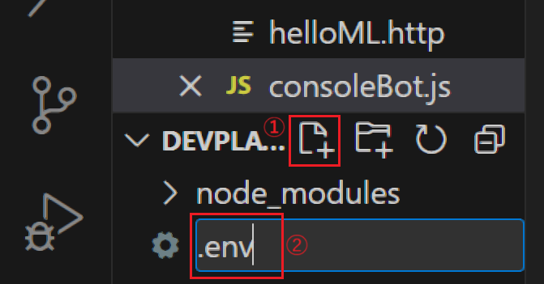
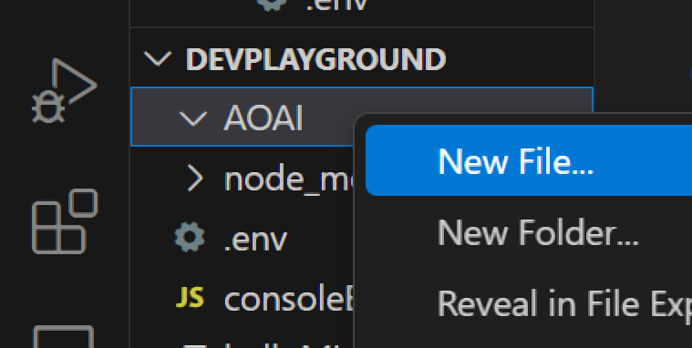

# Azure Open AI サービスとアプリケーションの統合

この演習では Azure OpenAI サービスか提供するサービスを外部から利用する方法を体験します。

Azure OpenAI の言語モデルは REST API を提供しているため HTTPS を扱える開発言語であればその機能を利用することができます。

## 目次

この演習 3 で実施するタスクは以下のとおりです

- [タスク 1 : Azure Open AI サービスの API 利用]()
    - [curl コマンドによる呼び出しの確認]()
    - [HTTP Client ツールによる呼び出しの確認]()
    - [会話構造について]()

- [タスク 2 : ボット アプリケーションの作成]()
    - [コンソールで動作するオウム返しアプリケーションの作成]()
    - [Azure OpenAI ライブラリを利用した言語モデルへのメッセージの送信]()
	- [コンソールで動作する基本的なチャットボット アプリの作成]()

- [タスク 3 : Function Calling 機能を使用した任意の関数の実行]()
    - [REST による動作の確認]()
	- [チャットボット アプリからの内部関数の呼び出し]()
	- [チャットボット アプリからの画像生成モデルの利用]()

- [タスク 4 : RAG (Retrieval-Augmented Generation) の実装]()
    - [キーワードのベクトル化]()
    - [ベクトル検索機能の作成]()
	- [RAG の実装]()

## 準備

演習 3 のタスクを実施するためには以下の準備が必要です。

もし以下アプリケーションやランタイムのインストールが済んでいない場合はリンク先の手順に従ってインストールを行ってください。

### ツールのインストール

- [**Visual Studio Code**](https://code.visualstudio.com/)

    - [**REST Client 拡張**](https://marketplace.visualstudio.com/items?itemName=humao.rest-client)


- [**Node.js**](https://nodejs.org/ja/)

    > 最新の LTS 版をインストールしてください。もしローカル環境で Node.js のバージョンを切り替える必要がある場合には Windows では [**nvm-windows**](https://github.com/coreybutler/nvm-windows) 、Mac では [nvm](https://github.com/nvm-sh/nvm) を使用すると便利です。
    > 詳しくは以下のドキュメントを参照してください。

    - [**nvm-windows のインストール**](https://learn.microsoft.com/ja-jp/windows/dev-environment/javascript/nodejs-on-windows#install-nvm-windows-nodejs-and-npm)

    - [**nvm のインストール**](https://learn.microsoft.com/ja-jp/windows/dev-environment/javascript/nodejs-on-wsl#install-nvm-nodejs-and-npm)

### 接続情報の入手

REST API の呼び出しに必要となるエンドポイントと API キーを入手します。

具体的な手順は以下のとおりです。

1. Azure Portal にサインインします

2. [**演習 1 - タスク 1 : Azure ポータルから Open AI リソースを作成**](Ex01.md#%E3%82%BF%E3%82%B9%E3%82%AF-1--azure-%E3%83%9D%E3%83%BC%E3%82%BF%E3%83%AB%E3%81%8B%E3%82%89-open-ai-%E3%83%AA%E3%82%BD%E3%83%BC%E3%82%B9%E3%82%92%E4%BD%9C%E6%88%90) で作成した OpenAI サービス インスタンスのプロパティ画面を開きます

3. 画面左側のメニューから **キーとエンドポイント** を選択し、表示された画面で \[**キー**\](※キー 1、キー 2 のどちらでも構いません)と \[**エンドポイント**\] をコピーします

    

コピーしたキーとエンドポイントは後続のタスクで使用しますので、メモ帳などに貼り付けて保持してください。

このキーとエンドポイントは言語モデルだけでなく、同じく Azure OpenAI インスタンスにデプロイされた埋め込みモデル、画像生成モデルとも共通です。なおこの 2 のモデルはそれぞれタスク 2、タスク 3 で使用されます。

<br>

## タスク 1 : Azure Open AI サービスの API 利用

Azure OpenAI の言語モデルは REST API を提供しているためサービスのエンドポイントと API キー、リクエストとレスポンスのデータ構造を理解すれば開発言語だけでなく HTTP クライアントツールやコマンドラインからも利用することができます。

このタスクでは curl コマンドを Visual Studio Code の REST Client 拡張を使用して Azure OpenAI サービスのエンドポイントにリクエストを送信し、レスポンスを確認します。

### curl コマンドによる呼び出しの確認

Azure OpenAI サービスのエンドポイントに curl コマンドを使用してリクエストを送信し、レスポンスを確認します。

curl コマンドは [演習 2 タスク 3 の独自のデータを追加する前のリクエスト内容の確認](Ex02-2.md#%E7%8B%AC%E8%87%AA%E3%81%AE%E3%83%87%E3%83%BC%E3%82%BF%E3%82%92%E8%BF%BD%E5%8A%A0%E3%81%99%E3%82%8B%E5%89%8D%E3%81%AE%E3%83%AA%E3%82%AF%E3%82%A8%E3%82%B9%E3%83%88%E5%86%85%E5%AE%B9%E3%81%AE%E7%A2%BA%E8%AA%8D)
でコピーしたものを使用します。

もしなんらかの理由でコピーしていない場合は再度、[同手順](Ex02-2.md#%E7%8B%AC%E8%87%AA%E3%81%AE%E3%83%87%E3%83%BC%E3%82%BF%E3%82%92%E8%BF%BD%E5%8A%A0%E3%81%99%E3%82%8B%E5%89%8D%E3%81%AE%E3%83%AA%E3%82%AF%E3%82%A8%E3%82%B9%E3%83%88%E5%86%85%E5%AE%B9%E3%81%AE%E7%A2%BA%E8%AA%8D)を実施してコマンドをコピーしてください。

コマンドをコピーしたら以下の手順を実行します。

\[**手順**\]

1. コピーしたコマンド内の **YOUR_API_KEY** の部分をこの演習の [接続情報の入手]() でコピーした Azure OpenAI サービスの API キーに置き換えます 

2. ターミナル画面、あるいはコマンドライン画面を表示し、Windows の場合は以下のコマンドを実行して bash に切り替えます

    ```bash
    bash
    ```
3. この手順の 1 番目で置き換えたコマンドを貼り付けて実行し、Azure OpenAI サービスの言語モデルからレスポンスが返ることを確認します

    例) "こんにちは" というテキストを送信した場合のレスポンス

    

このようにサービスのエンドポイントと API キーとリクエストのデータ構造を理解すればコマンドラインからも Azure OpenAI サービスを利用することが確認できました。

<br>

### HTTP Client ツールによる呼び出しの確認

Azure OpenAI サービスの API を呼び出す際にやり取りされるデータ構造を確認するために Visual Studio Code の REST Client 拡張を使用してリクエストを送信し、レスポンスを確認します。

手順は以下のとおりです。

\[**手順**\]

1. エクスプローラーを使用してローカル環境に **devPlayground** という名前のフォルダを作成します

2. 作成したフォルダの上でマウスの右クリックをし、表示されたコンテキストメニューから \[**Visual Studio Code で開く**\]、もしくは \[**Code で開く**\] を選択します

    もし、コンテキストメニューに上記のメニューが表示されない場合は \[**その他のオプションを確認**\] メニューをクリックして表示されるメニューから選択してください

3. Visual Studio Code が起動するので、画面左のツリービューの **New File** ボタンをクリックするか、画面上部のメニュー \[**File**\] - \[**New File..**\] をクリックして **helloML.http** という名前のファイルを作成します

    

4. 作成したファイルに以下の内容をコピーして貼り付けます

    ```
    @apiKey = ここに API キーを入力
    @endpoint = curl コマンドに指定されている URL を入力 

    POST {{endpoint}} HTTP/1.1
    Content-Type: application/json
    api-key: {{apiKey}}

    {
        "messages": [
            {
                "role":"user",
                "content":"こんにちは"
            }
        ]
    }

    ```
    変数 **@apiKey** と **@endpoint** にはそれぞれコピーしてある curl コマンドの API キーとエンドポイントを指定します。このとき " (ダブルクォーテーション) は使用せず、そのままの値を記述してください。

5. ファイルに記述されている **POST** の上に \[**Send Request**\] と表示されるのでクリックします

    

6. リクエストが送信され、レスポンスが表示されることを確認します

    

このように Visual Studio Code の REST Client 拡張を使用して Azure OpenAI サービスの API を呼び出すことができました。

以降、これを使用して Function Calling、JSON Mode 等、リクエストするデータ構造の変更により言語モデルの振る舞いがどのように変化するかの確認を行います。

<br>


## タスク 2 : ボット アプリケーションの作成

このタスクでは、Node.js を使用して Azure OpenAI サービスの言語モデルと会話を行うためのコンソール アプリケーションを作成します。

最初に、コンソール入力されたユーザーからのメッセージを出力するだけのオウム返しアプリケーションを作成し、その後、Azure OpenAI ライブラリを使用して Azure OpenAI サービスの言語モデルにメッセージを送信する外部モジュールを個別に作成して最後に統合します。


### タスク 2-1. コンソールで動作するオウム返しアプリケーションの作成

コンソールで動作するオウム返しアプリケーションを作成します。

手順は以下のとおりです。

\[**手順**\]

1. [タスク 1 で作成した](#http-client-%E3%83%84%E3%83%BC%E3%83%AB%E3%81%AB%E3%82%88%E3%82%8B%E5%91%BC%E3%81%B3%E5%87%BA%E3%81%97%E3%81%AE%E7%A2%BA%E8%AA%8D)フォルダー **devPlayground** を Visual Studio Code で開きます

2. Visual Studio Code の画面左のツリービューの **New File** ボタンをクリックするか、画面上部のメニュー \[**File**\] - \[**New File..**\] をクリックして **consoleBot.js** という名前のファイルを作成します

    

3. 作成した **consoleBot.js** ファイルが編集状態で Visual Studio Code に開かれるので、以下の内容をコピーして貼り付けます

    ```javascript
    //[PLACEHOLDER:require lm.js]
    
    // 標準入力を取得するための設定
    process.stdin.setEncoding('utf-8');

    function showPrompt() {
        console.log('\nPrompt:');
    }
    showPrompt();

    // 標準入力を受け取る
    process.stdin.on('data', async function(data) {

        //[REPLACE:LM output]
        console.log('\n入力された文字:', data.trim());
    
        showPrompt();
    });

    ```
    貼り付けたらキーボードの \[**Ctrl**\] + \[**S**\] キーを押下して保存します

4. Visual Studio Code の上部のメニュー \[View\] - \[Terminal\] をクリックします

    画面下部にターミナル画面が表示されるので、以下のコマンドを実行して Node.js で作成したファイルを実行します。

    ```bash
    node consoleBot.js
    ```

    なお、この操作はコンソール画面で行っても同様に動作します。

5. コンソール画面に表示された `Prompt:` の後に任意の文字列を入力してキーボードの \[**Enter**\] キーを押下し、入力した文字列がそのまま返ることを確認します

    動作が確認できたらキーボードの \[**Ctrl**\] + \[**C**\] キーを押下してプログラムを終了します

ここまでの作業でアプリケーションのひな型が完成しました。


### タスク 2-2 Azure OpenAI ライブラリを利用した言語モデルへのメッセージの送信

Azure OpenAI ライブラリを利用して、これまでの演習で作成した言語モデルにメッセージを送信し応答を受け取り出力する外部モジュールを作成します。

手順は以下のとおりです。

\[**手順**\]

1. 記述するコードの実行に必要になるライブラリ [dotenv](https://www.npmjs.com/package/dotenv) と [OpenAI Node API Library](https://www.npmjs.com/package/openai)をインストールします。

    Visual Studio Code のターミナル画面で以下のコマンドを実行します

    ```bash
    npm install dotenv --save
    ```
    ```bash
    npm install openai
    ```

2. 環境変数の代わりをする **.env** ファイルを作成します。このファイルはプロジェクトのルートディレクトリに配置します

    Visual Studio Code の画面左のツリービューの **New File** ボタンをクリックするか、画面上部のメニュー \[**File**\] - \[**New File..**\] をクリックして **.env** という名前のファイルを作成します

    

3. 作成した .env ファイルが編集状態で Visual Studio Code に開かれるので、この演習の [**接続情報の入手**](#%E6%8E%A5%E7%B6%9A%E6%83%85%E5%A0%B1%E3%81%AE%E5%85%A5%E6%89%8B)でコピーしておいた Azure Open AI サービスへのエンドポイントと API KEY を貼り付けます

    ```
    AZURE_OPENAI_ENDPOINT=ここにエンドポイントを記述
    AZURE_OPENAI_API_KEY=ここに API キーを入力を記述
    ```

    貼り付けたらキーボードの \[**Ctrl**\] + \[**S**\] キーを押下して保存します

4. Azure OpenAI 関連の処理を行うファイルをまとめるフォルダーを作成します

    Visual Studio Code の画面左のツリービューの **New Folder** ボタンをクリックするか、画面上部のメニュー \[**File**\] - \[**New Folder..**\] をクリックして **AOAI** という名前のフォルダを作成します

    

5. 作成した AOAI フォルダを右クリックし、表示されたコンテキストメニューから \[**New File**\] を選択して **lm.js** という名前のファイルを作成します

    

6. 作成した **lm.js** ファイルが編集状態で Visual Studio Code に開かれるので、以下の内容をコピーして貼り付けます

    このコードは必要なライブラリの参照と、この手順で設定した環境変数を読み込む処理を行い、その他、システムメッセージ等の定義を行っています

    ```javascript
    //ライブラリの参照
    const { AzureOpenAI } = require("openai");
    const dotenv = require("dotenv");
    dotenv.config();

    //[PLACEHOLDER:require funcs.js]

    const endpoint = process.env["AZURE_OPENAI_ENDPOINT"] ;
    const apiKey = process.env["AZURE_OPENAI_API_KEY"] ;
    const apiVersion = "2024-05-01-preview";
    const deployment = "gpt-4o-mini"; 
    //言語モデルとユーザーの会話を保持するための配列
    var messages = [
        { role: "system", content: "You are an useful assistant." },
    ];
    ```
7. 続けて以下のコードを貼り付けます

    このコードは Azure OpenAI サービスの言語モデルにメッセージを送信と、その結果を返す関数で非同期で動作するため async/await を使用しています

    ```javascript
    //Azure OpenAI にメッセージを送信する関数
    async function sendMessage(message) {
        if(message) messages.push({ role: 'user', content: message });
        const client = new AzureOpenAI({ endpoint, apiKey, apiVersion, deployment });
        const result = await client.chat.completions.create({
            messages: messages,
            model: "",
            //[PLACEHOLDER:functionCalling tools:]
        });

        for (const choice of result.choices) {
            //[REPLACE:functionCalling if{}]
            return choice.message.content;
        }
    }
    ```

8. 続けて結果を確認するための以下のコードを貼り付けます。

    ```javascript
    //[DELETE:Integration ml.js]
    //結果を確認するための即時実行関数
    (async () => {
        const message = 'あなたに誕生日はありますか?';
        const reply = await sendMessage(message);
        console.log(reply);
    })();
    ```

    このコードは sendMessage 関数を呼び出し、その結果をコンソールに出力するためだけのコードですが sendMessage 関数が非同期で動作するため、async/await を使用する必要があるので即時実行関数で記述しています。

9. **lm.js** のコードが正しく動作するか、実行して確認します

    Visual Studio Code のターミナル画面で以下のコマンドを実行し、Azure OpenAI の言語モデルから応答が返ることを確認します。

    ```bash
    node AOAI/lm.js
    ```

    もし、うまくいかない場合は以下のサンプルのコードを使用してみてください。

    * [**Azure OpenAI の言語モデルにメッセージを送信するサンプルコード**](samples/lm_0.js)


ここまでの手順で Azure OpenAI サービスの言語モデルとメッセージを送受信するためのコードが記述できました。


### コンソールで動作する基本的なチャットボット アプリの作成

タスク 2-1 で作成したオウム返しコンソール アプリケーションとタスク 2-2 で作成した Azure OpenAI ライブラリを使用した言語モデルへのメッセージの送信機能を統合して、コンソールで動作する基本的なチャットボット アプリケーションを作成します。

これによりユーザーはコンソールを使用して Azure OpenAI サービスの言語モデルと継続的に会話を行うことができるようになります。

具体的な手順は以下のとおりです。

\[**手順**\]

1. **ml.js** 内の sendMessage 関数を外部から呼び出せるようにします

    その前に不要な、実行結果を確認するためのコードを削除します。

    具体的には `//[DELETE:Integration ml.js]` とコメントの下にある即時実行関数をコメントごと削除するかコメントアウトします。

    ```javascript
    //[DELETE:Integration ml.js]
    //結果を確認するための即時実行関数
    /*
    (async () => {
        const message = 'あなたに誕生日はありますか?';
        const reply = await sendMessage(message);
        console.log(reply);
    })();
    */

2. **ml.js** ファイルの最後に以下のコードを追加します

    このコードは sendMessage 関数を外部から呼び出せるようにするための処理です

    ```javascript
    module.exports = {sendMessage};
    ```

2. オウム返しアプリケーションの **consoleBot.js**  ファイルをオープンし、ファイルの先頭にあるコメント `//[PLACEHOLDER:require lm.js]` を以下のコメントとコードに置き換えます

    ```javascript
    //[PLACEHOLDER:require rag.js]
    const lm = require('./AOAI/lm.js');
    ```
    
    これで ml.js で公開されている関数を consoleBot.js で使用することができるようになります。

3. **consoleBot.js** ファイル内のコメント `//[REPLACE:LM output]` とその下の行のコードをメントごと以下のコードに置き換えます

    ```javascript
    //[REPLACE: RAG Integration]
    console.log(`\nAI : ${await lm.sendMessage(data.trim())}`);
    ```

4. **consoleBot.js** を実行して Azure OpenAI サービスの言語モデルと継続的に会話ができるか確認します

    Visual Studio Code のターミナル画面で以下のコマンドを実行します

    ```bash
    node consoleBot.js
    ```

    コンソール画面に `Prompt:` の文字が表示されたら、その後に任意の文字列を入力してキーボードの \[**Enter**\] キーを押下し、Azure OpenAI サービスの言語モデルからの応答が返ることを確認します

5. いくつかの任意のメッセージを送信し、会話が継続的に行えることを確認したら以下のメッセージを送信します

    ```
    現在の時刻を教えてください
    ```

    Azure OpenAI サービスの言語モデルが現在時刻については回答できないことを確認します

    キーボードの \[**Ctrl**\] + \[**C**\] キーを押下してプログラムを終了します。

ここまでの手順で Azure OpenAI サービスの言語モデルと継続的に会話を行うコンソール アプリケーションが作成できました。

もし、うまくいかない場合は以下のサンプルのコードを使用してみてください。


* [**Azure OpenAI の言語モデルにメッセージを送信するモジュールのサンプルコード**](samples/consoleBot_1.js)
* [**Azure OpenAI の言語モデルと継続的に会話を行うコンソール ボットのサンプルサンプルコード**](samples/consoleBot_1.js)

<br>


 ### タスク 3 : Function Calling 機能を使用した任意の関数の実行 

Azure OpenAI サービスの言語モデルは gpt-4-0613 と gpt-3.5-turbo-0613 から関数呼び出し(Function Calling) 機能を提供しており、アプリケーションかから送信する言語モデルへのメッセージに任意の関数の情報を含めて呼び出すことで、言語モデルがその関数を使用するタイミングを判断して実行すべき関数名、引数の値を返すようになります。

この一連の流れを図で示すと以下のようになります。

Function Calling を使用する場合は、アプリケーションから言語モデルに送信するメッセージの中にアプリケーションが呼び出したい関数の情報を含めて送信します。なお、関数の情報は任意の個数含めることができます。

* ユーザーからのメッセージの内容が追加された関数と関係ないと言語モデルが判断した場合は通常の応答を返します。

    

* もし、ユーザーからのメッセージの内容が追加された関数のどれかと関係があると言語モデルが判断した場合は、その関数の名前と引数の名前とセットすべき値のペアの情報を返すので、アプリケーション側ではその情報をもとに関数を実行します。

    

* アプリケーション内で関数の呼び出しが完了したらそのままユーザーにレスポンスを生成して返しても良いですが、関数の呼び出し結果を言語モデルに返すことで、言語モデルがユーザーに返すメッセージを生成してくれます。

    

* アプリケーションは、言語モデルが関数の実行結果をもとに生成した回答をユーザーに返します。

    

このようにすることで、あたかも言語モデルが関数を実行しているかのようなシームレスな連携が可能になります。


