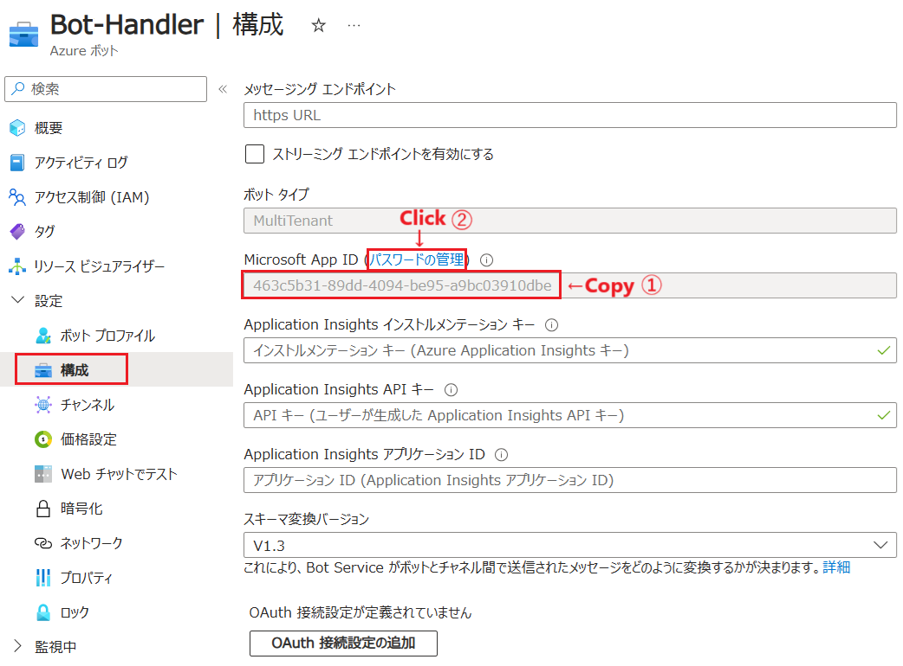
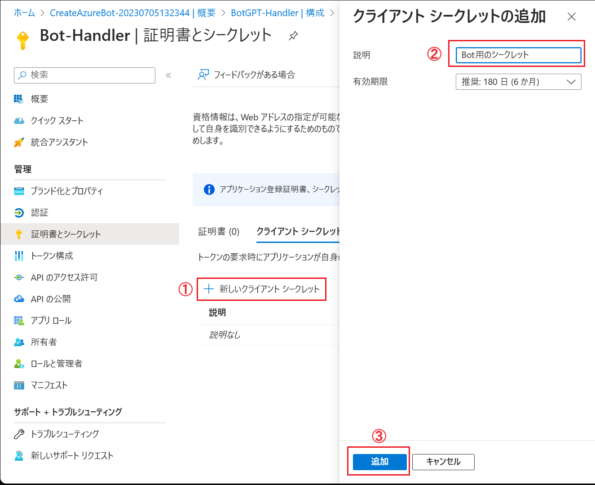
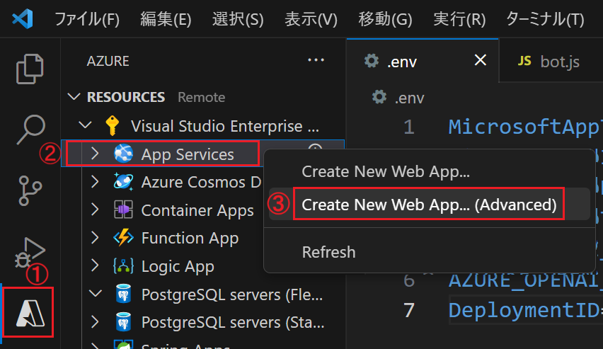
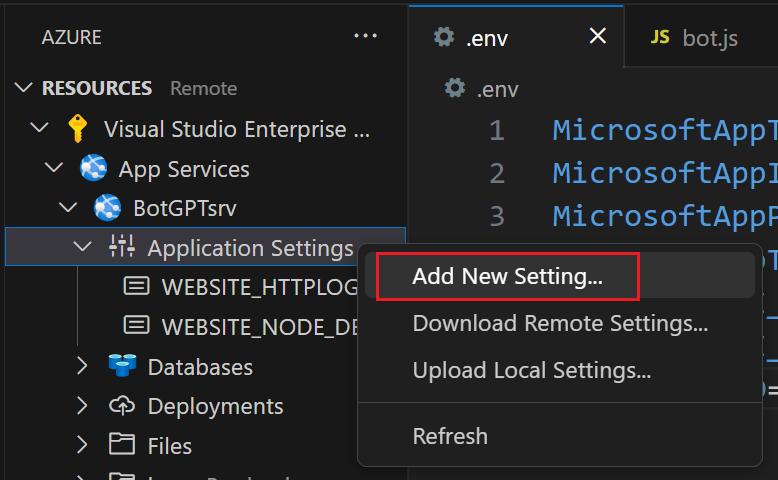
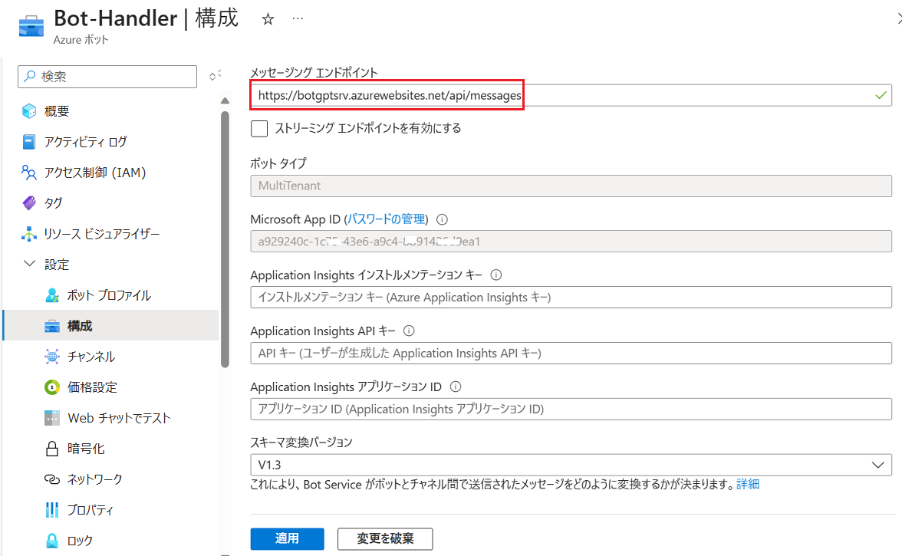
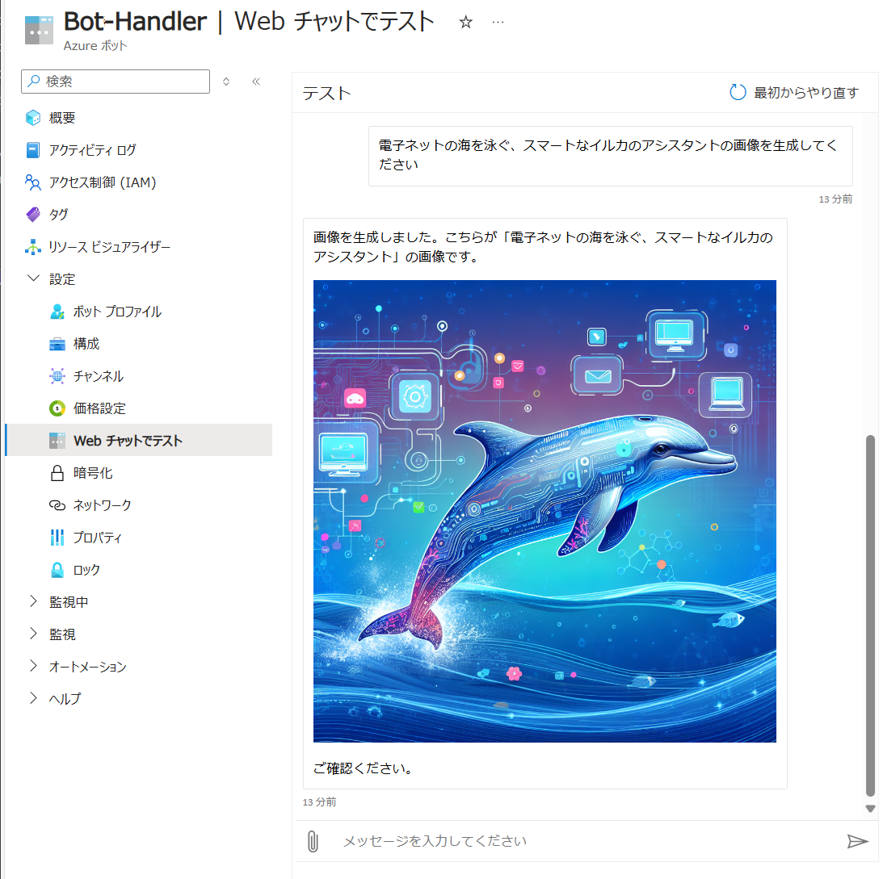
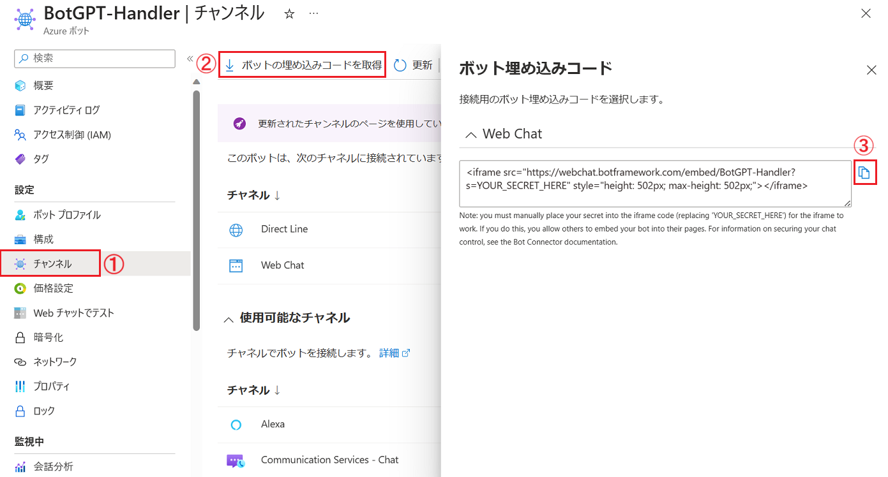
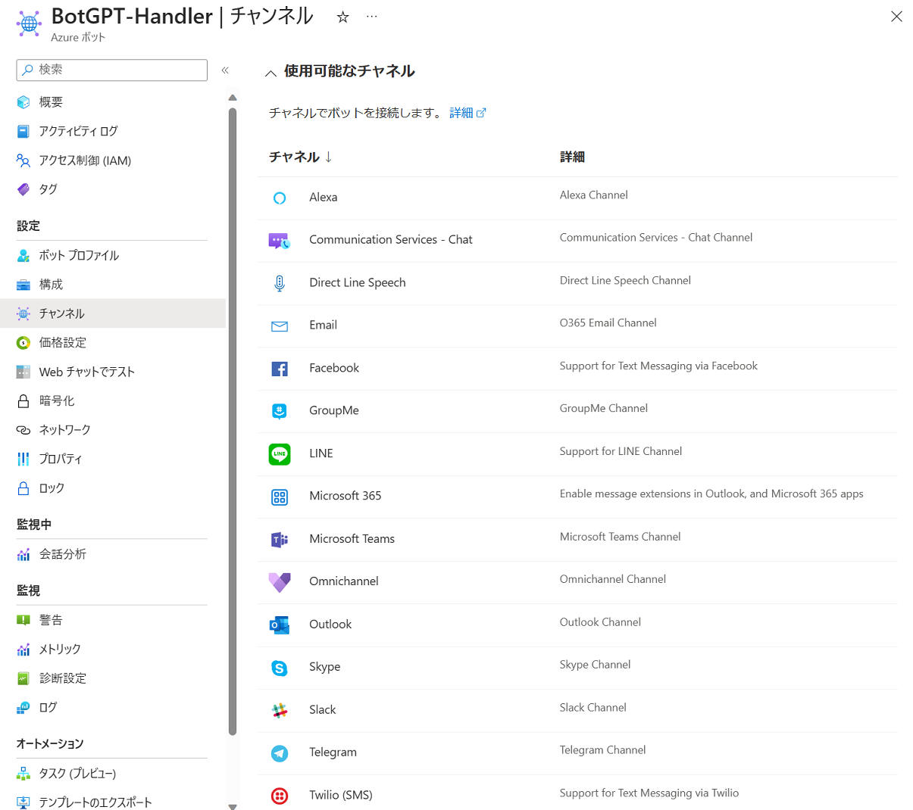

# 演習 4.2 : Azure リソースの作成とボットのデプロイ

## タスク 1 : Bot Service の作成

演習 2 で作成したボット アプリケーションをさまざまなメッセージングプラットフォームに接続可能なボットとして Bot Service にデプロイするために、Bot Service のインスタンスを作成します。

Bot Service の作成は Azure Portal から行います。

具体的な手順は以下の通りです。

\[**手順**\]

1. Azure Portal (<https://portal.azure.com>) にログインします

2. Azure Portal の左上にある「リソースの作成」をクリックします

3. "ボット"を検索し、検索結果の中から \[**Web App Bot**\] を選択します

    

4. プランの選択画面に遷移するで既定のまま \[**作成**\] ボタンをクリックします

5. \[**ボットの作成**\] 画面に遷移するので、各項目を以下のように設定します


    |項目|設定値|
    |:--|:--|
    |ボット ハンドル \*|`任意の名前`|
    |サブスクリプション \*|`任意のサブスクリプション`|
    |リソースグループ \*|`任意のリソースグループ`|
    |データ所在地 \*|**グローバル**|
    |価格レベル|**Standard**|
    |Microsoft App ID|**マルチテナント**| 
    |作成の種類|**新しい Microsoft アプリ ID の作成**|

    

    画面下部の \[**確認**\] ボタンをクリックし、その後 \[**作成**\] ボタンをクリックします

6. Azure Bot のデプロイが完了すると、\[**リソースに移動**\] ボタンが表示されるので、クリックして作成した Bot Service の概要画面に遷移します

7. 画面左側のメニュー ブレードから \[**構成**\] をクリックします

8. \[**構成**\] 画面に遷移するので、同画面の \[**Microsoft App ID**\] の GUID をコピー、メモ帳などに保持します、続けて \[**パスワードの管理**\] リンクをクリックします

    

9. \[**証明書とシークレット**\] に遷移するので、同画面の\[**+ 新しいクライアント シークレット**\]をクリックし、画面右側に表示される[**クライアント シークレットの追加**\]ブレードの各項目を以下のように設定します

    |項目|設定値|
    |:--|:--|
    |説明|`任意の説明`|
    |有効期限|`任意の期間`|

    \[**追加**\] ボタンをクリックします

    

10. クライアント シークレットが作成されると、\[**値**\] にシークレットの値が表示されるので、同画面のシークレットの値をコピーボタンを使用してコピーし、メモ帳などに保持します

    

    なお、生成されたシークレットはこの画面以降、二度と表示されないので、必ずこのタイミングで値をコピーしてください。

ここまでの作業で Azure Bot サービスの作成と App ID、シークレットの取得が完了しました。

<br>

## タスク 2 : ボット アプリケーションへの ID 設定と Azure App Service へのデプロイ

タスク 1 で作成したボット アプリケーションに、タスク 1 で取得した App ID とシークレットを設定し、Azure App Service にデプロイします。

具体的な手順は以下の通りです。

\[**手順**\]

1. [演習 4 の準備](Ex04-0.md#%E6%BA%96%E5%82%99)で作成したボット アプリケーションのプロジェクトを Visual Studio Code で開きます

2. Visual Studio Code の左側ツリービューから **.env** ファイルを開き、以下の編素の内容を以下のように編集します

    |項目|設定値|
    |:--|:--|
    |MicrosoftAppType|**MultiTenant**|
    |MicrosoftAppId|`タスク 1 で取得した App ID`|
    |MicrosoftAppPassword|`タスク 1 で取得したシークレット`|
    |MicrosoftAppTenantId|**common**|

    キーボードの \[**Ctrl**\] + \[**S**\] キーを押下して設定を保存します
    
3. Visual Studio Code の左側ツリービューから **package.json** ファイルを開き、内容を以下のように編集します

    |項目|設定値|
    |:--|:--|
    |name|`任意の名前`|
    |version|`任意のバージョン`|
    |description|`任意の説明`|

    (※) 今回は演習なので面倒な場合は既定のままで構いません。

    キーボードの \[**Ctrl**\] + \[**S**\] キーを押下して設定を保存します

    ここまでで、ボット アプリケーションの設定は完了です

4. ボットアプリケーションのデプロイ先となる Azure App Service を作成します

    この手順は Azure ポータル画面や Azure CLI などを使用して作成しても構いませんが、ここでは Visual Studio Code の Azure App Service 拡張機能を使用して作成します

    4-1. Visual Studio Code の画面左のツリービューから Azure アイコンをクリックします
    
    4-2. 表示された \[**RESOURCES**\] セクションの Azure ツリーから \[**App Service**\] を右クリックし、表示されたコンテキストメニューから \[**Create New Web App...(Advanced)**\] をクリックします

    

    4-3. \[**Create New Web App...**\] をクリックすると、コマンドパレットに作成に必要な情報を入力するためのプロンプトが表示されるので、以下のように入力します

    |項目|設定値|
    |:--|:--|
    |Enter a globally unique name for the new web app|`任意のユニークな名前`|
    |Select a resource group|`Bot Service をデプロイしたリソースグループ`|
    |Select a runtime stack|**Node 20 LTS**|
    |Select an OS|**Windows**|
    |Select new an Windows App Service plan|選択できるものがない場合は **+ Create new App Service plan** をクリックして作成|
    |Select an Application Insights resource for your app |**Skip for now**|
    |Select a pricing tier |**Free (F1)**|

    コマンド パレットの入力が完了すると、Azure App Service が作成されます

5. 作成した App Service に Node.js アプリケーションをホストするために必要な設定を追加します

    5-1. Visual Studio Code 画面左のツリービューの \[**RESOURCES**\] セクションの Azure ツリーから \[**App Service**\] をクリックして展開します

    5-2. 作成した App Service の名前が表示されるので、名前の前にある \[**>**\] マークをクリックしてツリーを展開します
    
    5-3. 展開されたツリーアイテムから \[**Application Settings**\] を右クリックし、表示されたコンテキストメニューから \[**Add New Setting...**\] をクリックします

    

    5-4. コマンドパレットに新しい設定を入力するためのプロンプトが表示されるので、以下のように入力します

    |項目|設定値|
    |:--|:--|
    |Enter new app setting name |**SCM_DO_BUILD_DURING_DEPLOYMENT**|
    |Enter value for "..."|**true**|

    コマンド パレットの入力が完了すると、新しい設定が追加されます

6.  作成した App Service にボット アプリケーションをデプロイします
    
    6-1. 画面左のツリービューからここまでの手順で作成した App Service の名前を右クリックし、表示されたコンテキストメニューから \[**Deploy to Web App...**\] をクリックします

    6-2. コマンドパレットに "**Select the folder to deploy**" というプロンプトが表示されるので、ボット アプリケーションのソースコードが格納されているフォルダを選択します

    上書きを警告するメッセージが表示された場合は、\[**Deploy**\] ボタンをクリックして続行します 

7. デプロイが完了するのを待ち、Web ブラウザーから以下の 名URL にアクセスします

    `https://App Service の名前.azurewebsites.net/api/messages`

    以下のようなメッセージが表示されれば、ボット アプリケーションのデプロイは成功です

    ```
    {
        "code": "MethodNotAllowed",
        "message": "GET is not allowed"
    }
    ```

ここまでの手順で、Bot Framework で作成したボット アプリケーションのデプロイは完了です。

次のタスクでは、デプロイした Bot Framework ボットアプリケーションのエンドポイントをタスク 1 で作成した Azure Bot に登録します。

<br>

## タスク 3. Azure Bot に Bot Framework ボットアプリケーションを登録する

タスク 2 の作業で、インターネット経由で Bot Framework ボットアプリケーションのエンドポイントにアクセスできるようになりました。

しかしエンドポイントをインターネットに公開しただけでは デプロイしたアプリケーションを Teams や Slack、LINE といったさまざまなメッセージング プラットフォームにボットとして登録することはできません。

Bot Framework ボットアプリケーションをさまざまなメッセージングプラットフォームのボットとして使用できるようにするには タスク 1 で作成した Azure Bot にエンドポイントを登録する必要があります。

具体的な手順は以下のとおりです。

\[**手順**\]

1. Azure Portal (<https://portal.azure.com>) にログインします

2. タスク 2 で作成した Bot Framework ボットアプリケーションのエンドポイントを確認するために、デプロイした Azure App Service の\[**概要**\]画面を表示します

3. \[**既定のドメイン**\] の値をコピーし、メモ帳などのテキストエディターに貼り付け、以下のように Bot Framework ボットアプリケーションのエンドポイントを作成します

    `https://既定のドメイン/api/messages`

    例えば、既定のドメインが `botapp123.azurewebsites.net` の場合は、以下のようになります

    `https://botapp123.azurewebsites.net/api/messages`

4. タスク 1 で作成した Azure Bot の\[**構成**\]画面を表示し、\[メッセージング エンドポイント\] の値を先ほど作成した Bot Framework ボットアプリケーションのエンドポイントに変更します

    

    \[**適用**\] ボタンをクリックします

5. 画面左のメニューブレードから \[**Web チャットでテスト**\] をクリックします

    Web チャット画面が表示され、"**Hello and welcome!**" とボット側からメッセージが送信されてくるのを待ち(※)、その後メッセージを入力してボットが応答することを確認します。

    
    
    
    > (※) 初回接続時は時間がかかるので、30 秒程度待ってもなにも表示されない場合は、Hello というメッセージを送信してみてください。ボットが正しく動作していれば、ボットから "Hello! How can I assist you today?" というメッセージが返ります。

    なお、このチャット画面は、画面左のメニューブレードから \[**チャネル**\] をクリックし、遷移した画面の \[**ボット埋め込みコード**\] をクリックすることで Web ページに埋め込むための iframe タグを取得することができます。

    


    
ここまでの手順で、Bot Framework ボットアプリケーションを Azure Bot に登録することができました。

これで Azure OpenAI サービスの 言語モデルの機能が組み込まれたアプリケーションを Bot Framework のボットとして公開し、さまざまなメッセージング プラットフォームに登録する準備ができました。

Azure Bot の \[チャンネル\] 画面には Microsoft Teams や Slack、LINE などのメッセージング プラットフォームにボットを提供する機能が Azure Bot の \[チャンネル\] 画面に用意されています。



さまざまなメッセージング プラットフォームにボットを登録する方法については、以下のドキュメントのチャネル一覧の表のから目的のメッセージングプラットフォーム名のリンクをクリックして各自で行ってください。

- [**1 つ以上のチャネルで実行するようにボットを構成する - チャネルの一覧**](https://learn.microsoft.com/ja-jp/azure/bot-service/bot-service-manage-channels?view=azure-bot-service-4.0#channels-list)

なお、Microsoft Teams への公開方法については [**演習 4.オプション : Microsoft Teams へのインストール**](Ex04-op-1.md) で紹介していますので、興味のある方は引き続きその演習を進めてください。

<br>

## まとめ

 演習 4 では、これまでの演習で作成したコンソール ボット アプリケーションの機能を Microsoft Bot Framework を使用したアプリケーションに移植する方法と、作成した Bot Framework ボット アプリケーションを Azure Bot に登録して公開する方法について学びました。

Azure OpenAI サービスの機能は、Microsoft Bot Framework と組み合わせることで、単一のアプリケーションをさまざまなメッセージング プラットフォームにボットとして提供することができます。

<br>

## 参考資料

- [**Azure OpenAI Service とは**](https://learn.microsoft.com/ja-jp/azure/cognitive-services/openai/overview)

- [**Azure Bot Service の概要**](https://docs.microsoft.com/ja-jp/azure/bot-service/bot-service-overview-introduction?view=azure-bot-service-4.0)

<br>

👉 [**演習 4.オプション : Microsoft Teams へのインストール**](Ex04-op-1.md)

<hr>

🏚️ [**README に戻る**](README.md)

👉 [演習 4.1 : コンソールボットからの機能の移植](Ex04-1.md)